# HELIX-IDS Architecture

## Scope

This document describes the current canonical architecture used by this repository.
It supersedes older descriptions based on binary-only or 32-feature pipelines.

## System Shape

HELIX-IDS is a multi-dataset intrusion detection pipeline with a shared feature space and a multi-task model.

- Datasets: NSL-KDD, UNSW-NB15, CICIDS-2018
- Unified input: 31 features total
- Model outputs:
  - Binary head: Normal vs Attack (2 classes)
  - Family head: attack-family taxonomy (7 classes)

## Data Architecture

The harmonization contract is implemented in `src/helix_ids/data/feature_harmonization.py`.

- Common features: 28
- Dataset-origin one-hot features: 3 (`is_nsl_kdd`, `is_unsw`, `is_cicids`)
- Total model input dimension: 31

The split/normalization contract is implemented in `src/helix_ids/data/multi_dataset_loader.py`.

- Per-dataset normalization is enforced to avoid cross-dataset leakage
- Stratified splitting is used where feasible
- Harmonized tensors are emitted for training/evaluation scripts

## Model Architecture

The canonical model is implemented in `src/helix_ids/models/helix_ids_full.py`.

- Shared MLP backbone (configurable hidden dimensions)
- Binary classification head (2 logits)
- Family classification head (7 logits)
- Multi-task optimization via `MultiTaskLoss`

Default config currently uses:

- Input dim: 31
- Hidden dims: `(512, 384, 256, 128)`
- Dropout: `(0.3, 0.3, 0.25, 0.2)`

## Training/Inference Topology

Primary operational entrypoints live in `scripts/`.

- Train: `scripts/train_helix_ids_full.py`
- Quantize lite: `scripts/quantize_helix_lite.py`
- Quantize micro: `scripts/quantize_helix_micro.py`
- Benchmark variants: `scripts/benchmark_helix_quantization.py`

Artifacts are written to:

- `models/helix_full/`
- `models/quantized/`
- `results/benchmarks/`

## Governance Layer

Governance is implemented under `src/helix_ids/governance/`.

- Stage orchestrator: `orchestrator.py`
- Entry wrapping: `entrypoint.py`
- Determinism controls: `determinism.py`
- Fingerprinting/lineage: `fingerprinting.py`, `run_registry.py`
- Promotion consensus: `promotion.py`

Tests for this layer are in `tests/test_governance/`.

## Repository Boundaries

Canonical code placement:

- Production package: `src/helix_ids/`
- Operational scripts: `scripts/`
- Tests: `tests/`
- Documentation: `docs/`

For file placement policy and cleanup behavior, see `docs/REPOSITORY_LAYOUT.md`.

## Legacy System Architecture

> **Document Version**: 1.0  
> **Last Updated**: 2026-04-08  
> **Status**: Production Ready  
> **Methodology**: SPARC (Architecture Phase)

---

## 1. System Overview

HELIX-IDS employs a modular, layered architecture designed for:

- **Portability**: Single codebase, multiple deployment targets
- **Scalability**: From ESP32 to cloud servers
- **Maintainability**: Clear separation of concerns
- **Performance**: Optimized inference pipelines

---

## 2. High-Level Architecture

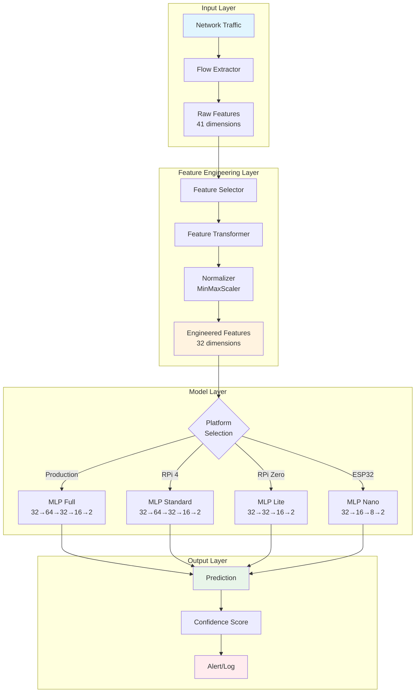

---

## 3. Component Architecture

### 3.1 Data Flow Pipeline

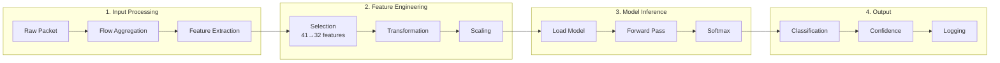

### 3.2 Module Dependency Graph

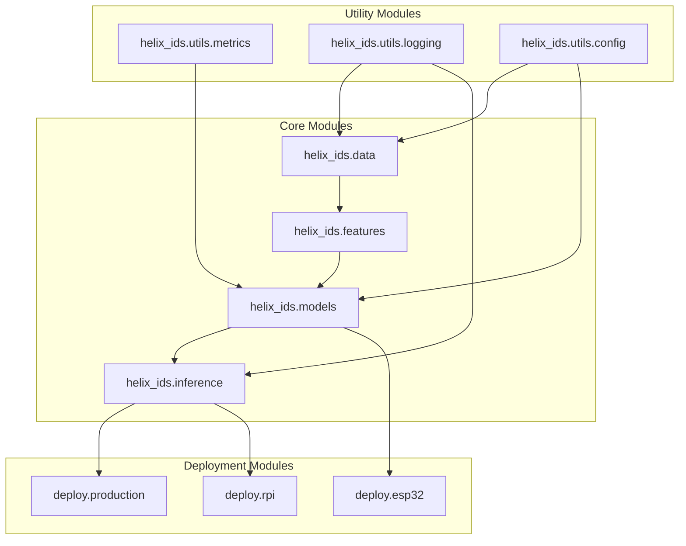

---

## 4. Model Architecture

### 4.1 MLP Network Architecture

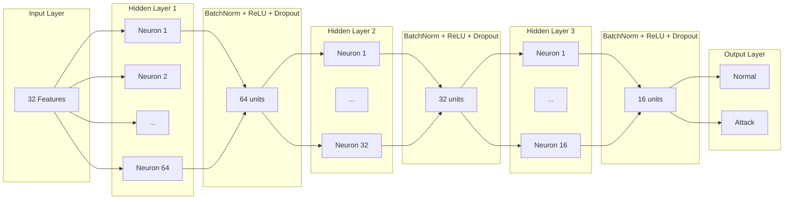

### 4.2 Layer Specifications

| Layer             | Input Dim | Output Dim | Parameters | Activation |
| ----------------- | --------- | ---------- | ---------- | ---------- |
| Linear 1          | 32        | 64         | 2,112      | -          |
| BatchNorm 1       | 64        | 64         | 128        | -          |
| ReLU 1            | 64        | 64         | 0          | ReLU       |
| Dropout 1         | 64        | 64         | 0          | -          |
| Linear 2          | 64        | 32         | 2,080      | -          |
| BatchNorm 2       | 32        | 32         | 64         | -          |
| ReLU 2            | 32        | 32         | 0          | ReLU       |
| Dropout 2         | 32        | 32         | 0          | -          |
| Linear 3          | 32        | 16         | 528        | -          |
| BatchNorm 3       | 16        | 16         | 32         | -          |
| ReLU 3            | 16        | 16         | 0          | ReLU       |
| Dropout 3         | 16        | 16         | 0          | -          |
| Linear 4 (Output) | 16        | 2          | 34         | Softmax    |
| **Total**         | -         | -          | **4,978**  | -          |

---

## 5. Multi-Platform Deployment Architecture

### 5.1 Platform Comparison

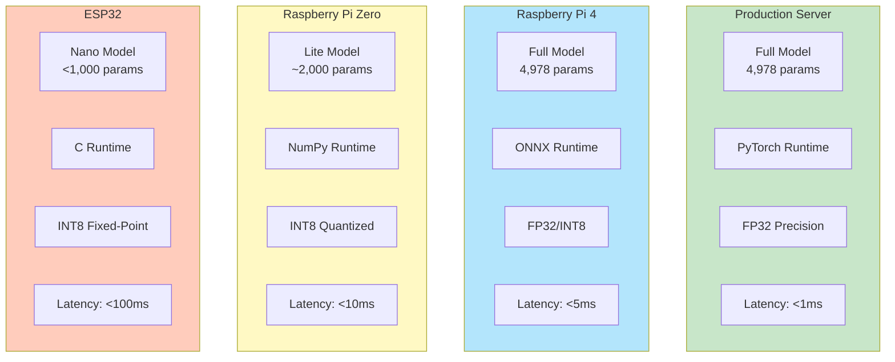

### 5.2 Deployment Pipeline

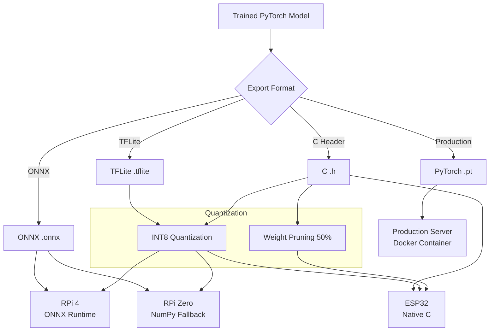

---

## 6. Feature Engineering Architecture

### 6.1 Feature Transformation Pipeline

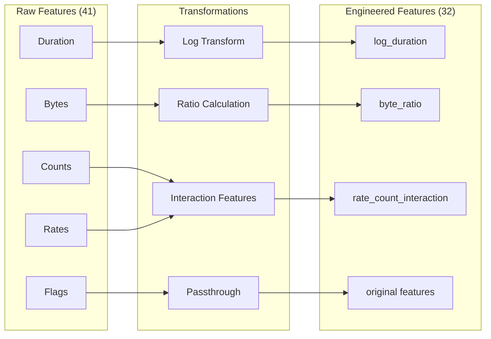

### 6.2 Feature Categories

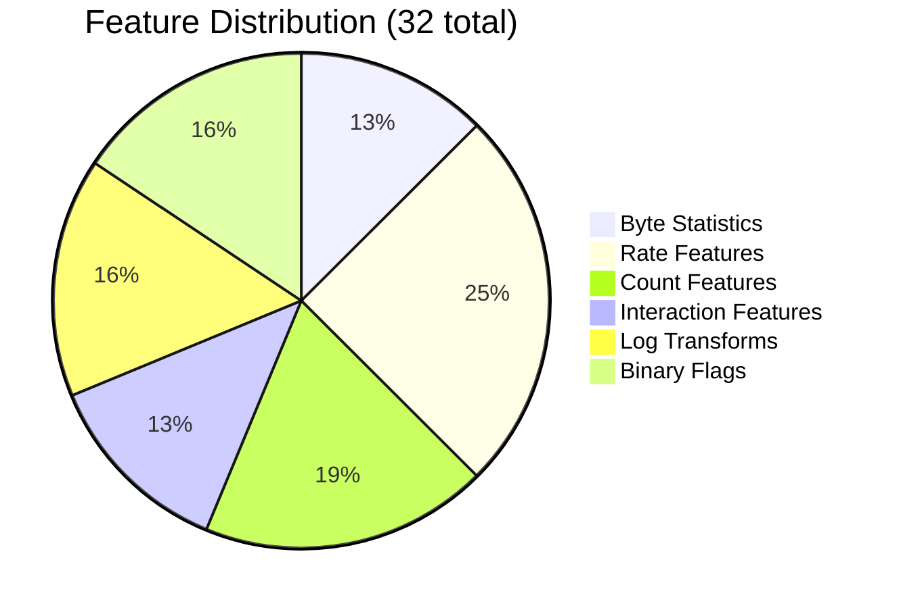

---

## 7. Training Architecture

### 7.1 Training Pipeline

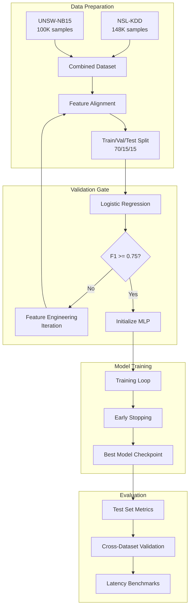

### 7.2 Training Hyperparameters

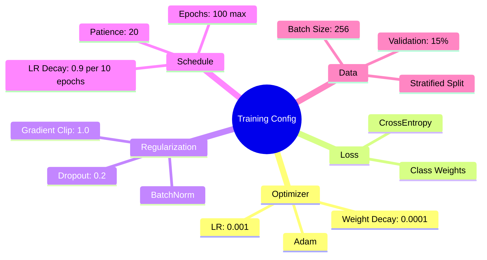

---

## 8. Cross-Dataset Generalization

### 8.1 Feature Alignment Architecture

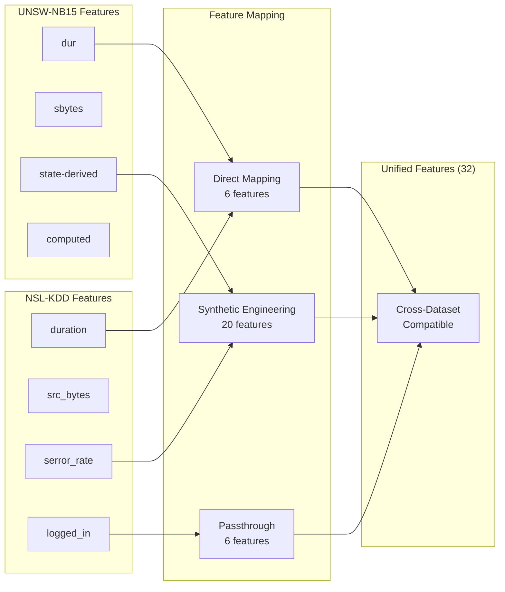

### 8.2 Label Alignment

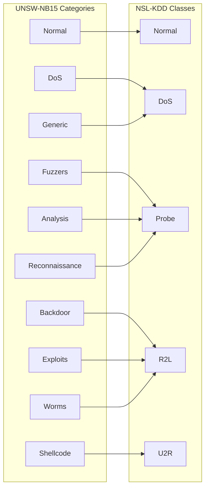

---

## 9. Inference Architecture

### 9.1 Real-Time Inference Pipeline

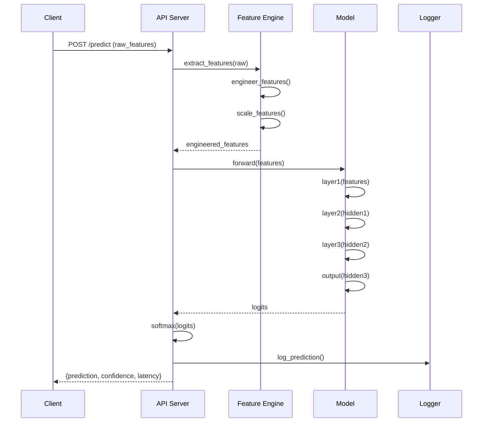

### 9.2 Batch Processing Architecture

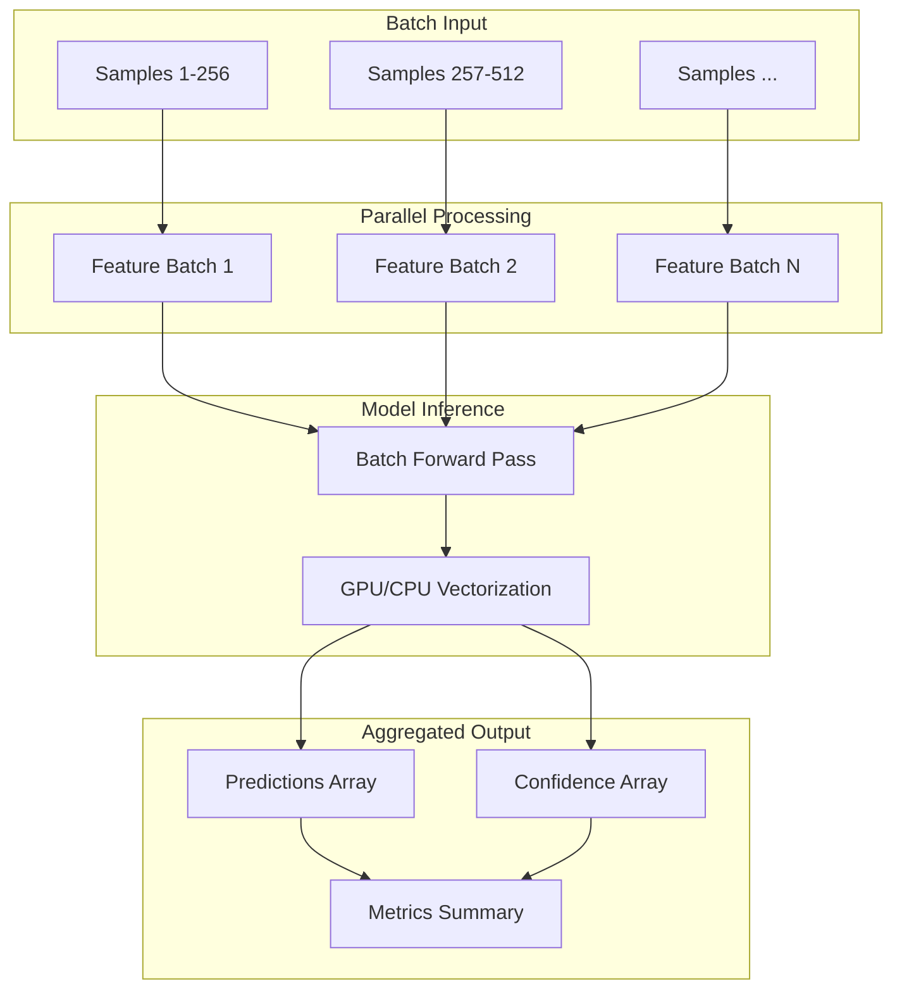

---

## 10. Directory Structure

```text
helix-ids/
├── config/
│   ├── helix_config.yaml       # Model configurations
│   ├── platform_configs.yaml   # Platform-specific settings
│   ├── training.yaml           # Training hyperparameters
│   └── attack_params.yaml      # Attack classification params
│
├── data/
│   ├── nsl_kdd/                # NSL-KDD dataset
│   ├── unsw_nb15/              # UNSW-NB15 dataset
│   ├── processed/              # Cleaned and aligned data
│   └── splits/                 # Train/val/test indices
│
├── docs/
│   ├── SPECIFICATION.md        # System requirements
│   ├── PSEUDOCODE.md           # Algorithms
│   ├── ARCHITECTURE.md         # This document
│   ├── REFINEMENT.md           # Optimization history
│   └── COMPLETION.md           # Final metrics & deployment
│
├── models/
│   ├── production/             # Production model artifacts
│   ├── rpi_4/                  # RPi 4 optimized model
│   ├── rpi_zero/               # RPi Zero optimized model
│   └── esp32/                  # ESP32 C header model
│
├── scripts/
│   ├── feature_engineering.py  # Feature pipeline
│   ├── train_platform_models.py
│   ├── deploy.py               # Deployment automation
│   └── benchmark_e2e.py        # End-to-end benchmarks
│
├── src/
│   └── helix_ids/
│       ├── __init__.py
│       ├── data/               # Data loading modules
│       ├── features/           # Feature engineering
│       ├── models/             # Model definitions
│       ├── inference/          # Inference pipelines
│       └── utils/              # Utilities
│
├── tests/
│   ├── test_data/
│   ├── test_models/
│   └── test_utils/
│
└── results/
    ├── benchmarks/             # Performance results
    ├── experiments/            # Experiment outputs
    └── figures/                # Visualizations
```

---

## 11. API Interface Architecture

### 11.1 REST API Endpoints

```text
Production API Endpoints:

POST /api/v1/predict
  - Input: {"features": [...]}
  - Output: {"prediction": 0/1, "confidence": 0.95, "latency_ms": 0.5}

POST /api/v1/predict/batch
  - Input: {"samples": [[...], [...], ...]}
  - Output: {"predictions": [...], "metrics": {...}}

GET /api/v1/health
  - Output: {"status": "healthy", "model_version": "1.0.0"}

GET /api/v1/model/info
  - Output: {"architecture": "MLP", "params": 4978, "features": 32}
```

### 11.2 Data Contracts

```python
# Request Schema
PredictRequest = {
    "features": List[float],  # 32 engineered features
    "return_probabilities": bool  # Optional, default False
}

# Response Schema
PredictResponse = {
    "prediction": int,           # 0=Normal, 1=Attack
    "class_name": str,           # "Normal" or "Attack"
    "confidence": float,         # 0.0-1.0
    "probabilities": {           # Optional
        "Normal": float,
        "Attack": float
    },
    "latency_ms": float,
    "model_version": str
}
```

---

## 12. Security Architecture

### 12.1 Model Security

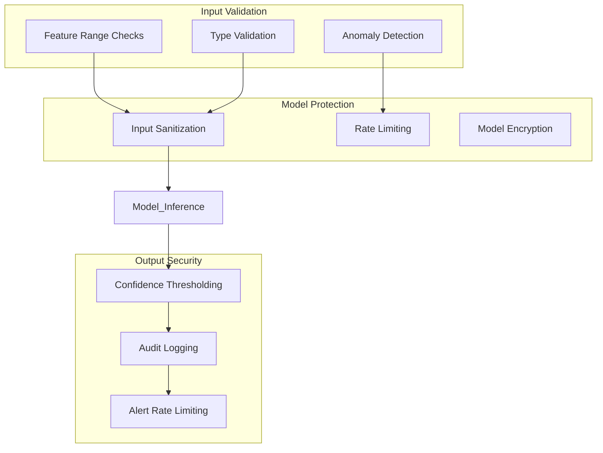

### 12.2 Adversarial Robustness

- **Input perturbation tolerance**: ±5% feature noise
- **Confidence calibration**: Platt scaling for reliable uncertainty
- **Out-of-distribution detection**: Mahalanobis distance threshold
- **Model integrity**: SHA-256 checksum validation

---

## 13. Scalability Considerations

### 13.1 Horizontal Scaling (Production)

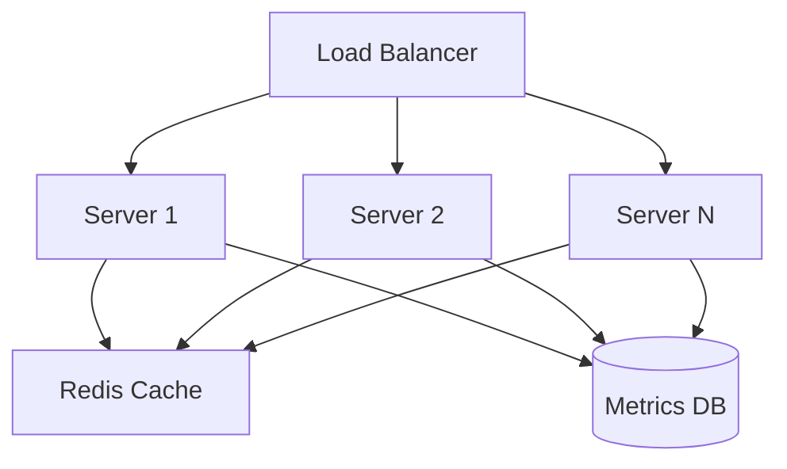

### 13.2 Edge Scaling (IoT)

- **Hub-and-Spoke**: Central RPi 4 with ESP32 nodes
- **Federated Updates**: Model updates pushed from cloud
- **Local Aggregation**: Batch predictions on hub

---

*Document generated following SPARC Architecture methodology. See REFINEMENT.md for optimization history.*
