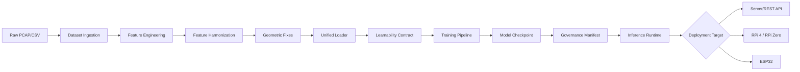
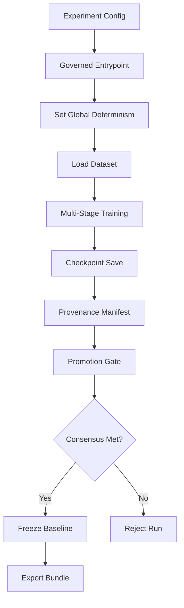
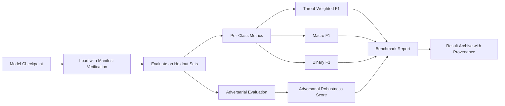
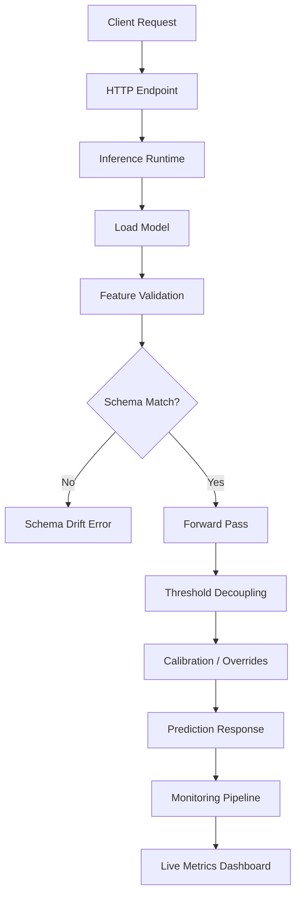
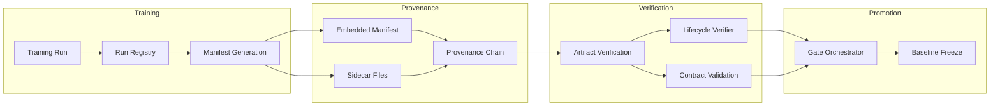
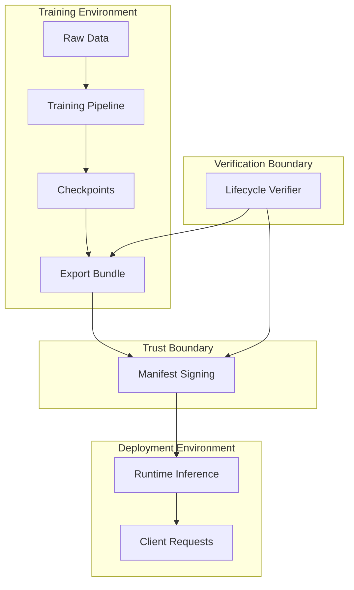

# HELIX-IDS: System Architecture

Last updated: 2026-06-09

## System Overview

HELIX-IDS (Hierarchical Edge-optimized Lightweight Intrusion eXpert) is a network intrusion detection system for edge deployment. It combines a neural network classifier with domain adaptation, formal governance and provenance verification, and runtime monitoring.

The system runs on three tiers:
- **Server/Cloud**: Training, evaluation, high-throughput inference
- **Edge (RPi 4, RPi Zero)**: Optimized inference with smaller model variants
- **Microcontroller (ESP32)**: Minimal inference with quantized models

## Design Goals

1. **Detection accuracy**: Match or exceed baselines on NSL-KDD, UNSW-NB15, CICIDS-2018
2. **Edge viability**: Under 100ms inference on Raspberry Pi hardware
3. **Provable reproducibility**: Every artifact carries a cryptographic provenance chain
4. **Operational safety**: Drift detection, staged rollouts, traffic expansion guards
5. **Threat-awareness**: Rare attack classes (R2L, U2R) get targeted loss weighting
6. **Multi-dataset transfer**: Domain adaptation for training on one dataset and generalizing to others

## Component Map

```
helix_ids/
├── __init__.py          # Package root — re-exports all public APIs
├── cli.py               # CLI entry point (helix-ids)
│
├── config/
│   ├── __init__.py      # Exports: PlatformConfig, load_platform_config
│   ├── helix_full_config.py  # Training/Data/Eval config dataclasses
│   └── platform_loader.py    # YAML-based platform configuration
│
├── data/
│   ├── __init__.py      # Exports: UnifiedDataLoader, FeatureEngineer, ...
│   ├── augmentation.py  # Attack-aware augmentation, class-balanced sampling
│   ├── data_audit.py    # Dataset quality auditing
│   ├── dataset_config.py# Per-dataset configuration (NSL-KDD, UNSW, CICIDS)
│   ├── feature_engineering.py  # 41-feature computation from raw network flows
│   ├── feature_harmonization.py# Cross-dataset feature mapping & normalization
│   ├── feature_io.py    # ARFF/CSV file loading and parsing
│   ├── geometric_representation_fixes.py  # Geometric feature transformations
│   ├── label_mapping.py # Unified label encoding across datasets
│   ├── learnability_contract.py  # Pre-training data quality verification
│   ├── loader_core.py   # Unified data loader
│   ├── multi_dataset_loader.py  # Multi-dataset split management
│   ├── preprocessing.py # Data preprocessing pipeline
│   └── unified_loader.py# High-level dataset loading interface
│
├── models/
│   ├── __init__.py      # Exports: TEMPORAL_ATTENTION, HELIXIDS, ...
│   ├── attention.py     # Temporal Attention Module (TAM) — 3 variants
│   ├── classifier.py    # Hierarchical classification head
│   ├── core.py          # Base HELIX model variants (Nano/Lite/Full)
│   ├── full.py          # Re-exports from helix_ids_full.py
│   ├── helix_ids.py     # HELIXIDS model definition
│   ├── helix_ids_full.py# Full HELIX model with MultiTaskLoss
│   ├── loss.py          # ThreatAwareFocalLoss, MultiTaskLoss, CalibrationLoss
│   ├── adaptation/
│   │   ├── __init__.py  # Exports all DA components
│   │   ├── combined_da.py    # Combined domain adaptation orchestrator
│   │   ├── coral_loss.py     # CORAL (CORrelation ALignment) loss
│   │   ├── dann.py           # Domain-Adversarial Neural Network
│   │   ├── label_aware_da.py # Class-conditional domain adaptation
│   │   ├── mmd_loss.py       # Maximum Mean Discrepancy loss
│   │   └── transfer_learning.py  # Multi-dataset pretrainer
│
├── governance/
│   ├── __init__.py      # Exports: governed_entrypoint, provenance tools, ...
│   ├── ast_validator.py # AST-based code validation
│   ├── determinism.py   # Global determinism/prng seeding
│   ├── entrypoint.py    # Governed training/eval entrypoint wrapper
│   ├── failure_memory.py# Persistent failure recording
│   ├── fingerprinting.py# Dataset/schema/manifest fingerprinting
│   ├── lifecycle_verifier.py  # Artifact lifecycle verification
│   ├── orchestrator.py  # Multi-gate promotion orchestrator
│   ├── parameters.py    # Governance policy parameters
│   ├── promotion.py     # Multi-seed consensus promotion
│   ├── provenance.py    # Artifact manifest, provenance chain, verification
│   └── run_registry.py  # Training run registration & metadata
│
├── metrics/
│   ├── __init__.py      # Exports: ClassMetrics, FNThresholds, ...
│   ├── adversarial_test.py # Adversarial robustness evaluation
│   ├── fn_tracker.py    # False-negative tracking per attack class
│   └── per_class_metrics.py # Per-class metric computation
│
├── operations/
│   ├── __init__.py      # Exports: seal_baseline, InferenceRuntime, ...
│   ├── baseline_freeze.py   # Baseline model sealing
│   ├── inference_runtime.py # Production inference engine
│   └── monitoring.py    # Live monitoring & drift detection
│
├── adaptation/
│   ├── __init__.py      # Exports: FeatureHarmonizer, OnlineFineTuner
│   ├── feature_harmonization.py  # Cross-dataset alignment (legacy path)
│   └── online_finetune.py       # Online fine-tuning during inference
│
├── utils/
│   ├── __init__.py      # Exports: ModelMetrics, Callback, ...
│   ├── callbacks.py     # Training callbacks (checkpoint, early stopping, LR)
│   ├── entropy_diagnostics.py   # Entropy-based batch composition analysis
│   ├── export.py        # ONNX/TorchScript export with provenance manifests
│   └── metrics.py       # Evaluation metrics (F1, PRI score, threat-weighted)
│
└── pipeline/            # (removed — experimental multi-stage pipeline)
```

## Data Flow



### Detailed data flow:

1. **Raw datasets** arrive as CSV/ARFF from NSL-KDD, UNSW-NB15, and CICIDS-2018
2. **`download_datasets.py`** orchestrates acquisition
3. **`process_nsl_kdd.py` / `process_unsw_nb15.py` / `process_cicids.py`** normalize per-dataset format
4. **`feature_engineering.py`** computes 41 canonical features from raw network flows
5. **`feature_harmonization.py`** maps dataset-specific features to the canonical schema
6. **`geometric_representation_fixes.py`** applies geometric transformations for feature-space alignment
7. **`unified_loader.py`** / `loader_core.py` provide a unified interface for training
8. **`learnability_contract.py`** validates data quality before training begins
9. Training produces model checkpoints with governance manifests embedded

## Training Flow



### Key components:

- **`train_helix_ids_full.py`** (8722 lines): Primary training script. Supports multi-dataset training with configurable loss, class balancing, curriculum, and domain adaptation.
- **Config-driven**: YAML experiment configs in `config/experiments/`
- **Determinism seeding**: `governance/determinism.py` ensures reproducible training
- **Checkpoint provenance**: Every checkpoint includes an embedded manifest (SHA-256, training config, dataset fingerprint)
- **Promotion gates**: Multi-seed consensus validation via `promotion.py`

## Evaluation Flow



### Supported evaluation modes:
- **Holdout evaluation**: `holdout_evaluation_v2.py`
- **Benchmark orchestration**: `benchmarks.py`
- **Adversarial robustness**: `adversarial_test.py`
- **Phase 3 smoke test**: `test_phase3_smoke.py`

## Runtime Flow



### Server deployment:
- **`serve_rest.py`**: Flask-based REST API
- **`inference_runtime.py`**: Core inference engine with ONNX/TorchScript support
- **`monitoring.py`**: Real-time drift detection, schema validation, zero-prediction alerting

## Governance Flow



### Governance architecture (5 layers):

1. **Schema Governance** (ADR-001, ADR-002): Canonical feature schema, versioning, lifecycle
2. **Hash Authority** (ADR-003): SHA-256-based fingerprinting for datasets, schemas, and artifacts
3. **Enforcement Pipeline** (ADR-004): Runtime verification of schema compliance
4. **Provenance Chain**: Artifact manifests with cryptographic hashes linking artifacts to their training provenance
5. **Lifecycle Verification**: End-to-end artifact integrity verification across the entire pipeline

## Security Boundaries



### Integrity vs. Authenticity:

| Property | Guarantee | Mechanism |
|----------|-----------|-----------|
| **Integrity** | Artifact content is verifiably unchanged | SHA-256 hashes in manifests |
| **Authenticity** | Not guaranteed | Manifests are not cryptographically signed |

The governance framework provides integrity guarantees. Any tampering with an artifact is detectable. Authenticity (proving who created an artifact) is not yet implemented. See `docs/SECURITY_REVIEW.md` for details.

## Failure Modes

| Component | Failure Mode | Detection | Recovery |
|-----------|-------------|-----------|----------|
| Data loading | Schema mismatch | SchemaDriftError | Re-harmonize or reject |
| Training | Gradient explosion | NaN detection | Gradient clipping (built-in) |
| Training | Single-class batch | Entropy guard | Batch resampling |
| Training | Poor convergence | EarlyStopping callback | Reduce LR or abort |
| Training | Promotion failure | GateOrchestrator | Multi-seed retry |
| Inference | Model load failure | File not found / hash mismatch | Fallback to prior version |
| Inference | Schema drift at runtime | LiveMonitor / ContractViolationError | Traffic shed or degrade |
| Deployment | Baseline not sealed | freeze_baseline check | Run freeze before deploy |
| Monitoring | Zero-prediction class | compute_zero_prediction_classes | Alert and investigate |

## Extension Points

1. **New dataset**: Add to `data/dataset_config.py`, implement label mapping in `label_mapping.py`, feature mapping in `feature_harmonization.py`
2. **New model variant**: Add to `models/core.py`, register in `models/__init__.py`
3. **New loss function**: Add to `models/loss.py`, expose in training script
4. **New domain adaptation method**: Add to `models/adaptation/`, register in `combined_da.py`
5. **New deployment target**: Add scaler to `models/<target>/`, configure in `deploy.py`
6. **New governance policy**: Add to `governance/parameters.py`, implement validation in relevant component

## Technical Debt

1. **ARCHITECTURE.md** contains legacy sections that no longer match the current codebase
2. **`adaptation/feature_harmonization.py`** duplicates some functionality from `data/feature_harmonization.py` (the data module is authoritative)
3. **`cli.py`** references subcommands that may not all be maintained
4. **`train_multidataset_v2_fixed.py`** at repo root is a thin wrapper that should be consolidated
5. **No Dockerfile**; environment setup is manual
6. **No CI/CD pipeline**; only local pre-commit validation