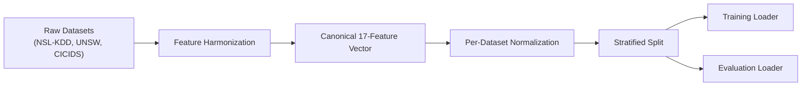

# Data Flow

> Last updated: 2026-06-18  
> How data moves from raw network captures to model predictions.

## Overview

## Dataset Acquisition

Three benchmark datasets are supported:

| Dataset | Raw Features | Format | Download |
|---------|-------------|--------|----------|
| NSL-KDD | 41 | CSV | Automated via `scripts/data/download_datasets.py` |
| UNSW-NB15 | 49 | CSV | Automated via `scripts/data/download_datasets.py` |
| CICIDS-2018 | ~80 | CSV | Automated via `scripts/data/download_datasets.py` |

Files are placed in `data/<dataset_name>/raw/` after download.

## Feature Harmonization

All three datasets are mapped to a **canonical 17-feature schema** via `src/helix_ids/data/feature_harmonization.py`:

- **14 common features** shared across all datasets
- **3 dataset-origin one-hot indicators** (`is_nsl_kdd`, `is_unsw`, `is_cicids`)

The canonical feature order is enforced, with `SchemaDriftError` raised on mismatch. NaN/inf values are detected post-harmonization by `validate_no_nan_inf()`.

### Cross-Dataset Mapping

| Canonical Feature | NSL-KDD Source | UNSW Source | CICIDS Source |
|------------------|---------------|-------------|---------------|
| protocol_type | protocol_type | proto | Protocol |
| service | service | service | — |
| flag | flag | state | — |
| src_bytes | src_bytes | spkts | Fwd Pkt Len Mean |
| dst_bytes | dst_bytes | dpkts | Bwd Pkt Len Mean |
| ... (14 total canonical) | | | |

Full mapping tables: see `feature_harmonization.py` functions `create_nslkdd_mapping()`, `create_unsw_mapping()`, `create_cicids_mapping()`.

## Normalization

Per-dataset normalization is enforced to avoid cross-dataset leakage:

- Mean/std computed on training split only
- Saved as `feature_columns.npy` and `canonical_contract.json`
- Evaluation split uses training-derived normalization
- Validation via `prepare_canonical_artifacts.py` before release

## Data Loaders

| Loader | File | Purpose |
|--------|------|---------|
| `MultiDatasetLoader` | `multi_dataset_loader.py` | Multi-dataset split management |
| `UnifiedDataLoader` | `unified_loader.py` | High-level loading interface |
| `FeatureEngineer` | `feature_engineering.py` | 41-feature computation from raw flows |
| `DataAudit` | `data_audit.py` | Dataset quality auditing |

## Data Flow During Training

1. Raw data loaded from disk via MultiDatasetLoader
2. Feature harmonization maps to 17 canonical features
3. NaN/inf validation
4. Learnability contract validates data quality
5. Stratified split (train/val/test) per dataset
6. DataLoader with per-dataset normalization
7. Harmonized tensors emitted to training script

## Data Flow During Inference

1. Feature vector (17 elements) received via POST /predict
2. Canonical order validated
3. Preprocessing transforms applied
4. Model forward pass
5. Post-processing (override layer, calibration)
6. Prediction returned with confidence score
7. Event logged to `live_events.jsonl` with full context
