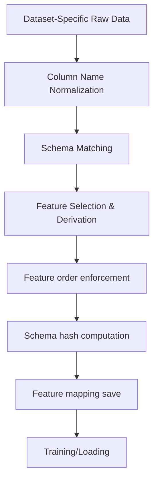

# Feature Harmonization

> Mapping three independent network intrusion datasets to a unified 41-feature, 7-class schema.

Last updated: 2026-06-09

## Problem Statement

Three benchmark datasets (NSL-KDD, UNSW-NB15, CICIDS-2018) define different feature sets:

| Dataset | Raw Features | After Selection | Shared with Canonical |
|---------|-------------|-----------------|----------------------|
| NSL-KDD | 41 | 41 | 41 (used as base schema) |
| UNSW-NB15 | 49 | 41 | ~30 direct, 11 derived |
| CICIDS-2018 | ~80 | 41 | ~25 direct, 16 derived |

Without harmonization, models trained on one dataset cannot be evaluated on another, and multi-dataset training is impossible.

## Architecture



## Mapping Functions

Three dataset-specific mapping functions in `data/feature_harmonization.py`:

### NSL-KDD Mapping (`create_nslkdd_mapping`, ~170 lines)

NSL-KDD's 41 features serve as the **canonical schema baseline**. Features 1-41 are used directly in order.

**Derived features**: Protocol type → one-hot encoded (tcp, udp, icmp)  
**Flags**: Connection state → numeric indicators

### UNSW-NB15 Mapping (`create_unsw_mapping`, ~200 lines)

UNSW-NB15 defines 49 features, of which ~30 have direct NSL-KDD analogs. The remaining 11 are derived:

| Canonical Feature | UNSW Source | Derivation |
|-------------------|-------------|------------|
| protocol_type | proto | String → one-hot encoding |
| service | service | String → service tier mapping |
| flag | state | State string → flag encoding |
| src_bytes | spkts * sport (or sbytes) | Computed bytes |
| dst_bytes | dpkts * dport | Computed bytes |
| land | (proto features) | Derived from protocol |
| wrong_fragment | (not present) | Set to 0 |
| urgent | (not present) | Set to 0 |
| hot | ct_srv_src | Derived count |
| num_failed_logins | (not present) | Set to 0 |
| num_compromised | ct_dst_ltm | Derived count |
| su_attempted | (not present) | Set to 0 |
| num_root | ct_srv_dst | Derived count |
| num_file_creations | ct_src_ltm | Derived count |
| num_shells | (not present) | Set to 0 |
| is_guest_login | (not present) | Derived from protocol |
| count | ct_srv_src | Direct mapping |
| srv_count | ct_srv_dst | Direct mapping |
| serror_rate | sttl based | Derived |
| srv_serror_rate | ct_srv_src based | Derived |
| rerror_rate | smean / dmean | Derived |
| srv_rerror_rate | ct_srv_dst based | Derived |
| same_srv_rate | ct_srv_src ratio | Derived |
| diff_srv_rate | ct_dst_sport_ltm | Derived |
| srv_diff_host_rate | ct_dst_src_ltm | Derived |
| dst_host_count | ct_dst_ltm | Direct mapping |
| dst_host_srv_count | ct_srv_dst | Direct mapping |
| dst_host_same_srv_rate | ct_srv_dst ratio | Derived |
| dst_host_diff_srv_rate | ct_dst_src ratio | Derived |
| dst_host_same_src_port_rate | ct_src_dport_ltm | Derived |
| dst_host_srv_diff_host_rate | ct_dst_src_ltm ratio | Derived |
| dst_host_serror_rate | ct_dst_ltm | Derived |
| dst_host_srv_serror_rate | ct_srv_dst | Derived |
| dst_host_rerror_rate | ct_dst_ltm | Derived |
| dst_host_srv_rerror_rate | ct_srv_dst | Derived |

### CICIDS-2018 Mapping (`create_cicids_mapping`, ~180 lines)

CICIDS-2018 has ~80 raw features. ~25 map directly, the rest are derived. Key challenges:

1. **Different naming convention**: CICIDS uses `Total Fwd Packets` vs. NSL-KDD's `src_bytes`
2. **Protocol encoding**: CICIDS uses integer protocol numbers; NSL-KDD uses strings
3. **Timestamp/flow features**: CICIDS includes flow timestamps not present in NSL-KDD
4. **Missing features**: Several NSL-KDD categorical flags (e.g., `su_attempted`, `num_shells`) don't exist in CICIDS — set to 0

## Feature Alignment Algorithm

The alignment process in `load_artifact()` / `harmonize_features()`:

```
1. Load raw data frame (dataset-specific)
2. Normalize column names (strip, lowercase, map aliases)
3. For each of 41 canonical features:
   a. If direct mapping exists → copy column
   b. If derivation function exists → compute from 1+ columns
   c. If neither → fill with default (0.0 for numeric, 0 for categorical)
4. Validate numeric types (coerce_numeric_strict)
5. Check for NaN/Inf (validate_no_nan_inf)
6. Enforce canonical feature order (enforce_feature_order)
7. Hash the ordered feature names (compute_schema_hash)
8. Return (dataframe, hash, mapping_record)
```

## Validation Logic

### Schema Validation (`validate_mapping`):

```python
def validate_mapping(mapping: FeatureMapping) -> bool:
    # Each canonical feature must have a source or derivation
    # All source columns must exist in the dataset
    # Data types must be compatible
    # No duplicate canonical features
```

### Feature Order Enforcement (`enforce_feature_order`):

```python
def enforce_feature_order(df, feature_order):
    # Reorder columns to match canonical order
    # Throw SchemaDriftError if any canonical feature is missing
    # Warn if extra columns are present (they will be dropped)
```

### NaN/Inf Detection (`validate_no_nan_inf`):

```python
def validate_no_nan_inf(df):
    # Check for any NaN, Inf, or -Inf values
    # Report which columns and how many
    # Block by default (configurable)
```

## Manifest Generation

When harmonization succeeds, a feature mapping artifact is generated:

```json
{
  "schema_version": "1.0.0",
  "canonical_features": ["duration", "protocol_type", ...],
  "dataset_mappings": {
    "nsl_kdd": {"type": "direct", "features_matched": 41, "features_derived": 0},
    "unsw_nb15": {"type": "mixed", "features_matched": 30, "features_derived": 11},
    "cicids2018": {"type": "mixed", "features_matched": 25, "features_derived": 16}
  },
  "schema_hash": "abc123...",
  "feature_order_hash": "def456..."
}
```

Stored at: `data/processed/feature_mappings.json`

## Provenance Requirements

Every harmonized dataset split carries:

1. **Schema hash**: SHA-256 of the ordered canonical feature list
2. **Dataset fingerprint**: SHA-256 of the processed data (first 1M bytes for performance)
3. **Mapping version**: Which version of `create_*_mapping` was used
4. **Processing timestamp**: When harmonization occurred

These are recorded in the governance manifest alongside training metadata.

## Failure Cases

| Failure | Symptom | Root Cause |
|---------|---------|------------|
| Missing feature column | SchemaDriftError: "Feature X not in dataframe" | Dataset column renamed or missing |
| Feature count mismatch | SchemaDriftError: "Expected 41, got N" | Harmonization missed a feature |
| Wrong feature order | SchemaDriftError: "Feature order hash mismatch" | Column ordering changed |
| NaN after harmonization | ValidationError | Feature derivation produced NaN |
| String instead of numeric | TypeError | Protocol/flag not one-hot encoded |
| Dataset column renamed upstream | Failed mapping | Column normalization didn't catch new name |

## Code References

| Component | File | Lines |
|-----------|------|-------|
| Dataset mapping functions | `src/helix_ids/data/feature_harmonization.py` | 1217 |
| Column normalization | `src/helix_ids/data/feature_harmonization.py` | `normalize_column_name()` |
| Type coercion | `src/helix_ids/data/feature_harmonization.py` | `coerce_numeric_strict()` |
| Schema hash | `src/helix_ids/data/feature_harmonization.py` | `compute_schema_hash()` |
| Feature order enforcement | `src/helix_ids/data/feature_harmonization.py` | `enforce_feature_order()` |
| Cross-dataset aligner (adapation) | `src/helix_ids/adaptation/feature_harmonization.py` | 705 |
| Label mapping | `src/helix_ids/data/label_mapping.py` | 259 |
| Geometric fixes | `src/helix_ids/data/geometric_representation_fixes.py` | 564 |
| Schema contract | `src/helix_ids/contracts/schema_contract.py` | 141 |