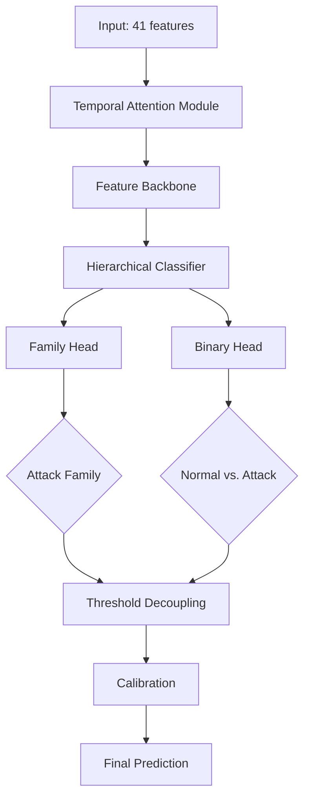
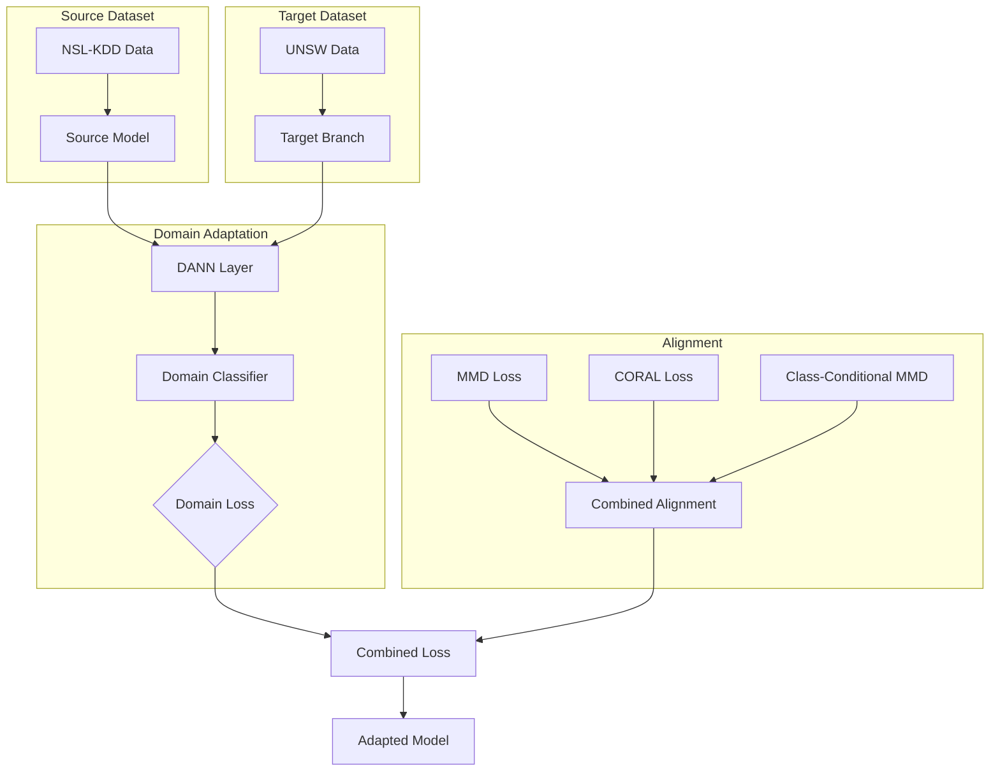
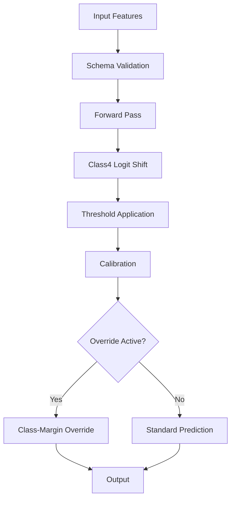

# Model Architecture

Last updated: 2026-06-09

## Model Families

HELIX-IDS defines four model variants for different deployment tiers:

| Variant | Parameters | Target | Inference Time (RPi 4) | Memory |
|---------|-----------|--------|----------------------|--------|
| HELIXNano | ~50K | ESP32 / RPi Zero | <30ms | <512KB |
| HELIXLite | ~150K | RPi Zero / RPi 4 | <50ms | <1MB |
| HELIXFull | ~500K | RPi 4 / Server | <100ms | <5MB |
| HELIXIDS | Configurable | All targets | Varies | Varies |

## Input Format

The model accepts a fixed-size feature vector:

| Field | Type | Dimensions | Description |
|-------|------|-----------|-------------|
| `features` | Float32 | 41 | Canonical feature vector |
| (Batch optional) | | [B, 41] | Batched inference supported |

### Canonical Feature Vector (41 elements):

Features 1-22: Basic connection features (duration, protocol, bytes, flags)  
Features 23-31: Content features (hot, failed logins, root, file creations)  
Features 32-41: Traffic features (count, srv_count, error rates, host counts)

See `data/feature_harmonization.py` for the full ordered list (`CANONICAL_FEATURE_ORDER`).

## Architecture



### Temporal Attention Module (TAM)

File: `src/helix_ids/models/attention.py` (482 lines)

The TAM applies attention over time-windowed features:

```
Input: [B, 41] features
  → Reshape: [B, T, F] where T=1 (single-frame) or T>1 (time-window)
  → Multi-head self-attention (4 heads)
  → Layer normalization
  → Residual connection
Output: [B, 41] context-enhanced features
```

Three variants:
- **TAMNano**: 2 attention heads, 32-dim hidden, single layer
- **TAMLite**: 4 attention heads, 64-dim hidden, 2 layers  
- **TAMFull**: 8 attention heads, 128-dim hidden, 3 layers

### Feature Backbone

File: `src/helix_ids/models/helix_ids.py` (552 lines)

A 3-layer MLP combining TAM output with raw features:

```
Input: [B, 41] context + [B, 41] raw
  → Concatenate: [B, 82]
  → FC(82 → 256) + ReLU + Dropout(0.3)
  → FC(256 → 128) + ReLU + Dropout(0.2)
  → FC(128 → 64) + ReLU
Output: [B, 64] feature embedding
```

### Hierarchical Classifier

File: `src/helix_ids/models/classifier.py` (633 lines)

A two-head architecture for hierarchical prediction:

```
Input: [B, 64] feature embedding
  → Family Head: FC(64 → 7) → Softmax → [B, 7] family logits
  → Binary Head:  FC(64 → 2) → Softmax → [B, 2] binary logits
  
  Family classes: Normal, DoS, Probe, R2L, U2R, Exploit, Generic
  Binary classes: Normal, Attack
```

**Threshold Decoupling** (key innovation):

After the family head produces logits, a per-class margin is applied:
- Positive class (family class = target): no margin
- Negative class (family class != target): margin applied

The margin tau is tuned per-class:
```python
tau = {
    0: 0.0,   # Normal
    1: 0.05,  # DoS
    2: 0.10,  # Probe
    3: 0.15,  # R2L
    4: 0.30,  # U2R   (highest — rarest class)
    5: 0.10,  # Exploit
    6: 0.10,  # Generic
}
```

The per-class margin prevents false negatives on rare classes by penalizing the model for predicting a common class when the rare class is correct.

## Training Objectives

Three complementary loss terms, combined in `MultiTaskLoss` (`models/loss.py` and `models/helix_ids_full.py`):

### 1. Classification Loss (Focal)

`FocalLoss` in `models/loss.py`:

```
FL(p_t) = -alpha_t * (1-p_t)^gamma * log(p_t)
```

Where:
- `p_t` = confidence in correct class  
- `alpha_t` = class weight (inverse frequency)
- `gamma` = focusing parameter (default: 1.5, reduced from standard 2.0 for stability)
- **Warmup**: Cross-entropy for first 10 epochs, then switch to focal

### 2. Family Margin Penalty

Penalizes the model when a non-target class logit exceeds the target class logit minus margin:

```
L_margin = mean(ReLU(max_other_logit - target_logit + tau))
```

Applied only to family head (not binary head).

### 3. Family Class 4 Logit Penalty

Targeted penalty for U2R class (class 4) dominance:

```
L_class4 = lambda * mean(ReLU(class4_logit - max_other_logits))
```

Addresses a specific failure mode where class 4 logits dominate due to the margin penalty structure.

## Domain Adaptation Pipeline

File: `src/helix_ids/models/adaptation/transfer_learning.py` (1272 lines)



### Components:

| Module | File | Lines | Purpose |
|--------|------|-------|---------|
| MultiDatasetPretrainer | `transfer_learning.py` | 1272 | Orchestrates multi-dataset pretraining |
| DANN | `dann.py` | 431 | Domain-adversarial loss for feature invariance |
| GradientReversalLayer | `dann.py` | N/A | Reverses gradients during domain adversarial training |
| MMDLoss | `mmd_loss.py` | 295 | Maximum Mean Discrepancy for distribution alignment |
| CORALLoss | `coral_loss.py` | 213 | Correlation alignment for second-order statistics |
| LabelAwareDA | `label_aware_da.py` | 790 | Class-conditional domain adaptation |
| CombinedDA | `combined_da.py` | 335 | Combines all DA losses with weighting |

## Runtime Inference

File: `src/helix_ids/operations/inference_runtime.py` (953 lines)



### Inference steps:

1. **Schema validation**: Check input dimension (41), no NaN/Inf, feature order
2. **Forward pass**: Model inference (TorchScript or ONNX)
3. **Class 4 logit shift**: Optional inference-time adjustment for U2R class (configurable)
4. **Threshold application**: Per-class margin from training config
5. **Calibration**: Confidence calibration (temperature scaling, configurable)
6. **Class-margin override**: Production override mechanism — runtime-adjustable per-class margins
7. **Output**: `{binary_prediction, family_prediction, confidence, logits}`

### Export formats:

| Format | File | Status |
|--------|------|--------|
| PyTorch (TorchScript) | `export.py` → `finalize_export_artifact()` | Active |
| ONNX | `export.py` → `ONNXExporter` | Available, experimental |
| Embedded manifest | `provenance.py` → `embed_manifest_in_onnx_metadata()` | Active (TorchScript) |

## Code Size Distribution

| Module | File | Lines | % of Model Code |
|--------|------|-------|-----------------|
| Transfer Learning | `adaptation/transfer_learning.py` | 1272 | 22% |
| Domain Adaptation (Label-Aware) | `adaptation/label_aware_da.py` | 790 | 14% |
| Full HELIX Model | `helix_ids_full.py` | 557 | 10% |
| Loss Functions | `loss.py` | 643 | 11% |
| Classifier | `classifier.py` | 633 | 11% |
| Base HELIX Model | `helix_ids.py` | 552 | 10% |
| Attention | `attention.py` | 482 | 8% |
| DANN | `adaptation/dann.py` | 431 | 7% |
| Combined DA | `adaptation/combined_da.py` | 335 | 6% |
| MMD Loss | `adaptation/mmd_loss.py` | 295 | 5% |
| CORAL Loss | `adaptation/coral_loss.py` | 213 | 4% |
| **Total** | | **6320** | **100%** |