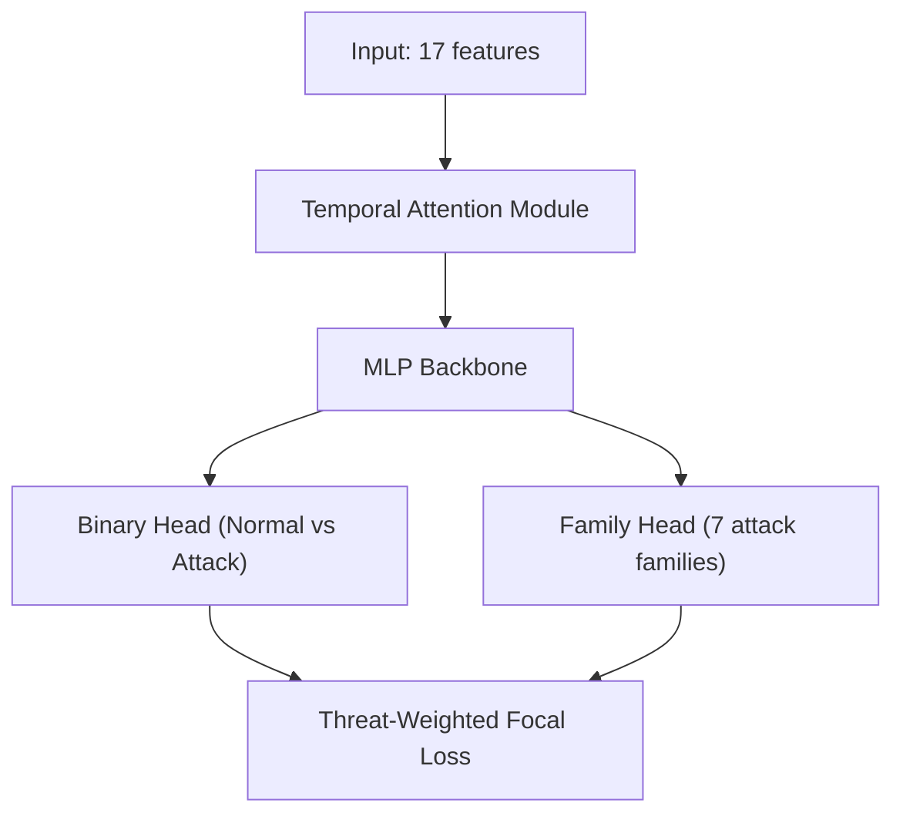
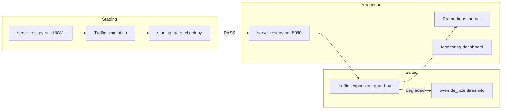

# HELIX-IDS System Architecture

> Last updated: 2026-06-18  
> This document is the single authoritative description of HELIX-IDS architecture.  
> It supersedes all earlier architecture descriptions.

## 1. High-Level Overview

HELIX-IDS (Hierarchical Edge-optimized Lightweight Intrusion eXpert) is a network intrusion detection system designed for **edge deployment first**. It combines a neural network classifier with domain adaptation, formal governance and provenance verification, and runtime monitoring.

The system runs on three tiers:
- **Server / Cloud**: Training, evaluation, high-throughput inference
- **Edge (RPi 4, RPi Zero)**: Optimized inference with smaller model variants
- **Microcontroller (ESP32)**: Minimal inference with quantized models

### Design Goals

1. **Detection accuracy** — Match or exceed baselines on NSL-KDD, UNSW-NB15, CICIDS-2018
2. **Edge viability** — Under 100ms inference on Raspberry Pi hardware
3. **Provable reproducibility** — Every artifact carries a cryptographic provenance chain
4. **Operational safety** — Drift detection, staged rollouts, traffic expansion guards
5. **Threat-awareness** — Rare attack classes (R2L, U2R) get targeted loss weighting
6. **Multi-dataset transfer** — Domain adaptation for training on one dataset and generalizing to others

## 2. Subsystems

```
src/helix_ids/
├── config/           Training/Data/Eval config dataclasses + YAML loading
├── data/             Dataset loading, feature harmonization, preprocessing
│   ├── feature_harmonization.py    Cross-dataset feature mapping (17 canonical features)
│   ├── multi_dataset_loader.py     Multi-dataset split management
│   ├── preprocessing.py            Data preprocessing pipeline
│   └── unified_loader.py           High-level dataset loading interface
├── models/           Neural network architectures
│   ├── helix_ids_full.py           Primary multi-task model (MLP backbone)
│   ├── attention.py                Temporal Attention Module (TAM)
│   └── loss.py                     Multi-task loss, focal loss
├── governance/       Provenance, determinism, entrypoint wrapping, promotion
│   ├── entrypoint.py               Non-bypassable governance wrapper
│   ├── determinism.py              Seed-based deterministic training
│   ├── fingerprinting.py           Artifact fingerprinting
│   ├── lifecycle_verifier.py       Checkpoint lifecycle validation
│   └── promotion.py                Multi-seed promotion consensus
├── operations/       Inference runtime, monitoring, recovery
│   ├── inference_runtime.py        REST inference server (Prometheus metrics)
│   ├── monitoring.py               System health monitoring
│   └── recovery_manager.py         Phase recovery and state management
└── utils/            Shared utilities (export, metrics)
```

Operational scripts live in `scripts/`:
- `scripts/training/train_helix_ids_full.py` — Primary training pipeline
- `scripts/operations/serve_rest.py` — REST inference server
- `scripts/operations/staging_gate_check.py` — Deployment gate checker
- `scripts/evaluation/benchmarks.py` — Benchmark orchestration
- `scripts/benchmarks/` — Performance, load, and soak testing

## 3. Data Architecture

The harmonization contract is implemented in `src/helix_ids/data/feature_harmonization.py`.

- **Input**: Three benchmark datasets (NSL-KDD, UNSW-NB15, CICIDS-2018)
- **Canonical features**: 17 features (14 common + 3 dataset-origin one-hot indicators)
- **Per-dataset normalization** enforced to avoid cross-dataset leakage
- **Stratified splitting** used where feasible

Full cross-dataset mapping is documented in FEATURE_HARMONIZATION.md (archived) and implemented in `feature_harmonization.py`.

### Schema Contract

- Runtime feature schema is **immutable** post-export
- Schema drift is a contract violation detected by `SchemaDriftError`
- Feature order enforced by canonical feature list

## 4. Model Architecture

The canonical model is implemented in `src/helix_ids/models/helix_ids_full.py`.

### Model Variants

| Variant | Parameters | Target | Inference Time (RPi 4) | Memory |
|---------|-----------|--------|----------------------|--------|
| HELIXNano | ~50K | ESP32 / RPi Zero | <30ms | <512KB |
| HELIXLite | ~150K | RPi Zero / RPi 4 | <50ms | <1MB |
| HELIXFull | ~500K | RPi 4 / Server | <100ms | <5MB |

### Multi-Task Architecture



Default configuration:
| Parameter | Value |
|-----------|-------|
| Input dim | 17 (canonical) |
| Hidden dims | (512, 384, 256, 128) |
| Dropout | (0.3, 0.3, 0.25, 0.2) |
| Binary classes | 2 (Normal, Attack) |
| Family classes | 7 |

### Temporal Attention Module (TAM)

Applies multi-head self-attention over time-windowed features:
- **TAMNano**: 2 heads, 32-dim hidden, 1 layer
- **TAMLite**: 4 heads, 64-dim hidden, 2 layers
- **TAMFull**: 8 heads, 128-dim hidden, 3 layers

## 5. Training Flow

### Primary pipeline
```bash
PYTHONPATH=src python scripts/training/train_helix_ids_full.py \
    --config config/experiments/smoke.yaml \
    --output /path/to/output \
    --device cpu
```

### Training governance
1. **Governed entrypoint** wraps the training call with non-bypassable governance
2. **Determinism** is set per seed via `set_global_determinism(seed)`
3. **Learnability contract** validates data quality before training starts
4. **Checkpoints** written with full provenance: SHA-256 manifest, contract sidecars, post-write verification
5. **Promotion gate** requires multi-seed consensus (3 seeds minimum) before baseline freezing
6. **Single-seed runs** are research-only and cannot produce deployable checkpoints

### Output artifacts
- Model checkpoints in `models/helix_full/`
- Quantized models in `models/quantized/`
- Benchmark results in `results/benchmarks/`
- Training/eval results in JSON per seed

## 6. Inference Flow

```bash
PYTHONPATH=src python scripts/operations/serve_rest.py \
    --checkpoint models/helix_full/helix_full_nsl_kdd_best.pt \
    --host 127.0.0.1 --port 8080 --device cpu
```

### Endpoints
- `POST /predict` — Accepts feature vector, returns binary + family predictions
- `GET /metrics` — Prometheus-format metrics (covered in MONITORING.md)
- `GET /health` — Liveness check

### Runtime safety
- **Coverage override rate**: fraction of predictions that required override actuation
- **Degraded state**: automatically set when `override_rate > 0.02`
- **Metrics**: `helix_requests_total`, `helix_coverage_override_rate`, `helix_degraded_state`, `helix_class_predictions_total`, `helix_class_entropy`
- **Event capture**: every request logged to `artifacts/operations/live_events.jsonl` for postmortem and retraining corpus

## 7. Governance Layer

Implemented under `src/helix_ids/governance/`.

| Component | Responsibility |
|-----------|---------------|
| `orchestrator.py` | Stage orchestration |
| `entrypoint.py` | Non-bypassable governance wrapping |
| `determinism.py` | Deterministic execution controls |
| `fingerprinting.py` | Artifact SHA-256 fingerprinting and lineage |
| `run_registry.py` | Run metadata registry |
| `promotion.py` | Multi-seed promotion consensus |
| `lifecycle_verifier.py` | Checkpoint lifecycle validation |
| `ast_validator.py` | AST safety checks (no eval/exec/import) |
| `schema_contract.py` | Canonical schema contract enforcement |

### Core guarantees
- **Schema immutability** — Runtime feature schema is immutable post-export
- **Hash authority** — All hashes use SHA-256 with canonical JSON encoding
- **Lineage completeness** — Every result carries full provenance lineage
- **Non-bypassable enforcement** — Governance is enforced at entrypoint level
- **AST safety** — No dynamic code generation in governed source files
- **Promotion consensus** — Checkpoints require 3-seed consensus with variance thresholds

## 8. Recovery Layer

`RecoveryManager` in `src/helix_ids/operations/recovery_manager.py` handles phase recovery:

- **Phase recovery**: resets all representation/phase flags via `TrainerState.reset_phase_state()`
- **Representation state**: resets centroids, EMA states, snapshot IDs, geometry thresholds
- **Governance metadata**: full provenance chain preserved with post-write verification
- **Checkpoints**: written with contract metadata and verifiable artifacts

**Known gaps** (non-blocking for formalization):
- Optimizer state is not saved/restored
- Scheduler state is not serialized
- RNG state is not persisted between runs
- Data loader state (iterator position) is not restorable
- No resumability mechanism — training always starts from epoch 0

## 9. Deployment Architecture



**Deployment stages**: Local validation → Staging controlled rollout → Production with guarded expansion → Monitoring → Incident response.

See `docs/operations/DEPLOYMENT.md` for the full deployment runbook.
