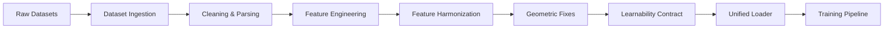
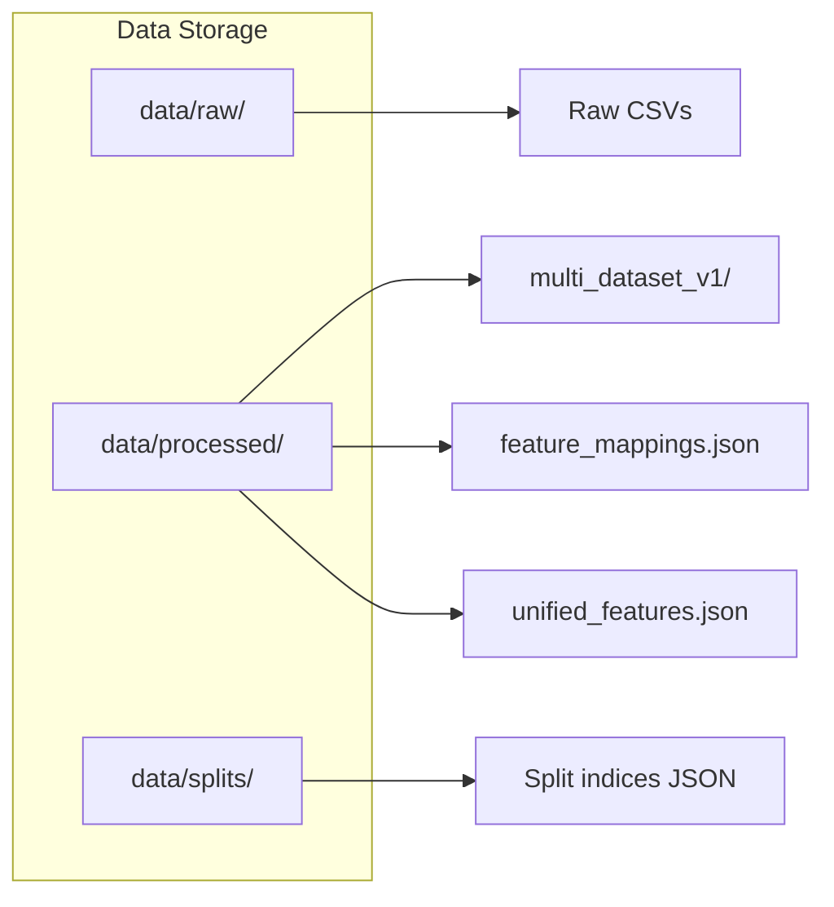

# Data Pipeline

> How raw network traffic captures become structured training data.

Last updated: 2026-06-09

## Overview

The HELIX-IDS data pipeline ingests three benchmark intrusion detection datasets (NSL-KDD, UNSW-NB15, CICIDS-2018), normalizes them to a unified 41-feature schema with a 7-class attack taxonomy, validates data quality, and produces train/val/test splits consumable by the training pipeline.



## Raw Datasets

### NSL-KDD
- **Source**: Canadian Institute for Cybersecurity
- **Files**: `KDDTrain+.txt`, `KDDTest+.txt`
- **Format**: CSV with 41 features + 1 label
- **Size**: ~18.6 MB (train + test)
- **Classes**: 23 attack types + 1 normal → mapped to 5 families + 1 normal
- **Key limitation**: Synthetic data, does not reflect real network traffic

### UNSW-NB15
- **Source**: Australian Centre for Cyber Security (ACCS)
- **Files**: `UNSW_NB15_training-set.csv`, `UNSW_NB15_testing-set.csv`
- **Format**: CSV with 49 features + 1 label
- **Size**: ~21.3 MB (train + test)
- **Classes**: 9 attack families + 1 normal
- **Note**: More realistic than NSL-KDD — includes modern attack patterns

### CICIDS-2018
- **Source**: Canadian Institute for Cybersecurity
- **File**: `cicids2018_cleaned.csv` (704 MB after processing)
- **Format**: CSV with ~80 features + 1 label
- **Size**: ~704 MB (processed)
- **Classes**: 7 attack types + 1 normal
- **Key limitation**: External storage (symlink in repo), must be downloaded separately
- **Note**: Largest dataset, most representative of real traffic

## Dataset Ingestion

### Entry Points

| Script | Purpose |
|--------|---------|
| `scripts/data/download_datasets.py` | Automated download of all three datasets |
| `scripts/data/process_nsl_kdd.py` | NSL-KDD-specific normalization |
| `scripts/data/process_unsw_nb15.py` | UNSW-NB15-specific normalization |
| `scripts/data/process_cicids.py` | CICIDS-2018-specific normalization |

### Process:

1. **`download_datasets.py`** acquires each dataset from its canonical source
2. Each `process_*.py` script:
   - Parses the raw file format
   - Drops irrelevant columns
   - Handles missing values
   - Normalizes categorical features
   - Writes to `data/processed/`

## Cleaning

### Data Quality Rules (in `data/preprocessing.py`):

1. **Missing values**: Rows with >50% NaN are dropped; remaining NaNs are imputed with column median
2. **Infinite values**: Clipped to ±1e6
3. **Duplicates**: Exact duplicate rows are removed (per dataset)
4. **Label consistency**: Attack labels mapped to 7-class unified taxonomy
5. **Feature type consistency**: All features cast to float32; categoricals one-hot encoded
6. **Infinity/NaN detection**: Pre-forward-pass check in inference runtime (`inference_runtime.py`)

### Dataset Audit (`data/data_audit.py`):

```python
audit = DataAudit()
audit.report(data/processed/multi_dataset_v1)
# Outputs: class distribution, missing values, feature ranges, schema hash
```

## Feature Harmonization

Each dataset defines different feature columns. The harmonization process maps them to a canonical 41-feature schema.

### Harmonization Source (`data/feature_harmonization.py`):

The master mapping is defined per dataset:

```python
# For each dataset, create_*_mapping returns a FeatureMapping dict
create_nslkdd_mapping()   # 41 NSL-KDD features → canonical 41
create_unsw_mapping()     # 49 UNSW-NB15 features → canonical 41
create_cicids_mapping()   # ~80 CICIDS-2018 features → canonical 41
```

### Harmonization steps:

1. **Column name normalization** (`normalize_column_name`): Standardizes whitespace, case, and separators
2. **Schema validation** (`validate_mapping`): Ensures all canonical features have a source
3. **Numeric coercion** (`coerce_numeric_strict`): For each feature, validates numeric type
4. **Missing feature handling**: Features not present in a dataset get default values (usually 0.0)
5. **Schema hash computation** (`compute_schema_hash`): SHA-256 of ordered feature names
6. **Feature order enforcement** (`enforce_feature_order`): Ensures output columns are in canonical order

## Schema Enforcement

The canonical schema is defined in `src/helix_ids/contracts/schema_contract.py`:

| Constant | Value | Purpose |
|----------|-------|---------|
| `CANONICAL_FEATURE_ORDER` | 41-element list | Ordered feature names |
| `CANONICAL_INPUT_DIM` | 41 | Fixed input dimension |
| `CANONICAL_FAMILY_CLASSES` | 7 | Attack family class labels |
| `CANONICAL_BINARY_CLASSES` | 2 | Normal vs. attack |
| `SCHEMA_HASH` | SHA-256 | Content hash of schema |
| `FEATURE_ORDER_HASH` | SHA-256 | Hash of ordered feature list |

### Enforced at:

- **Data loading**: `data/feature_harmonization.py` → `enforce_feature_order()`
- **Training**: `learnability_contract.py` → `assert_contract()` verifies schema match before training begins
- **Inference**: `inference_runtime.py` → validates input features match schema

## Dataset Versioning



### Directory structure:
```
data/
├── nsl_kdd/              # Raw NSL-KDD dataset
│   ├── train.csv
│   └── test.csv
├── unsw_nb15/
│   ├── train.csv
│   └── test.csv
├── cicids2018/           # Symlink to external storage
│   └── raw/
├── processed/
│   ├── multi_dataset_v1/ # Canonical processed dataset
│   │   ├── X_train.npy, X_val.npy, X_test_nsl_kdd.npy, etc.
│   │   └── feature_columns.npy
│   ├── cicids2018_cleaned.csv
│   ├── feature_mappings.json
│   └── unified_features.json
└── splits/               # Train/val/test split indices
    ├── nsl-kdd_indices.json
    ├── unsw-nb15_indices.json
    └── cicids2018_indices.json
```

## Data Validation

### Learnability Contract (`data/learnability_contract.py`, 2093 lines)

Before training, the pipeline verifies:

1. **Sufficient samples per class**: Each family class must have enough examples for meaningful learning
2. **Feature range validity**: All features must fall within expected bounds
3. **No constant features**: Features with zero variance are flagged
4. **Class balance assessment**: Checks if class imbalance will cause learning failure
5. **Schema hash match**: Current data schema hash must match contract
6. **Frozen snapshot**: If validation passes, a snapshot is frozen for reproducibility

### Failure actions:
- **Contract violation**: Training is aborted with a diagnostic message
- **Root cause reduction**: `derive_root_cause()` identifies which specific features/classes caused the failure
- **Recommendations**: `get_action_directive()` suggests fixes (e.g., "apply upsampling to class 4")

## Data Contracts

Defined in `src/helix_ids/contracts/`:

| Contract | Source | Purpose |
|----------|--------|---------|
| Schema Contract | `schema_contract.py` | Feature schema + hash |
| Immutable Schema | `docs/governance/IMMUTABLE_SCHEMA_CONTRACT.md` | Frozen schema policy |
| Learnability Contract | `learnability_contract.py` | Data quality gate |
| Diagnostic Contract | `diagnostic_contract.py` | Contract diagnostic tools |
| Runtime Contract | `schema_contract.runtime_contract_payload()` | Inference-time schema validation |

## Failure Handling

| Scenario | Detection | Action |
|----------|-----------|--------|
| Missing dataset file | FileNotFoundError | Report which file is missing |
| Schema hash mismatch | SchemaDriftError | Re-run harmonization |
| Feature count mismatch | ValueError | Check feature_columns.npy vs. schema |
| NaN in input | NaN detection (inference_runtime) | Clip or reject request |
| Learnability contract fail | LearnabilityThresholds | Abort training, print diagnostics |
| CICIDS-2018 not found | Process failure | Remind user about symlink |

## Reproducibility Controls

1. **Deterministic processing**: `governance/determinism.py` seeds numpy, torch, and Python RNG
2. **Split indices saved**: `data/splits/*.json` record exact train/val/test splits
3. **Feature mappings saved**: `data/processed/feature_mappings.json`
4. **Schema hash pinned**: `contracts/immutable_constants.py` contains hash of canonical schema
5. **Data audit log**: `data/data_audit.py` can generate a reproducibility report
6. **Learnability contract snapshot**: Freezes data state before training