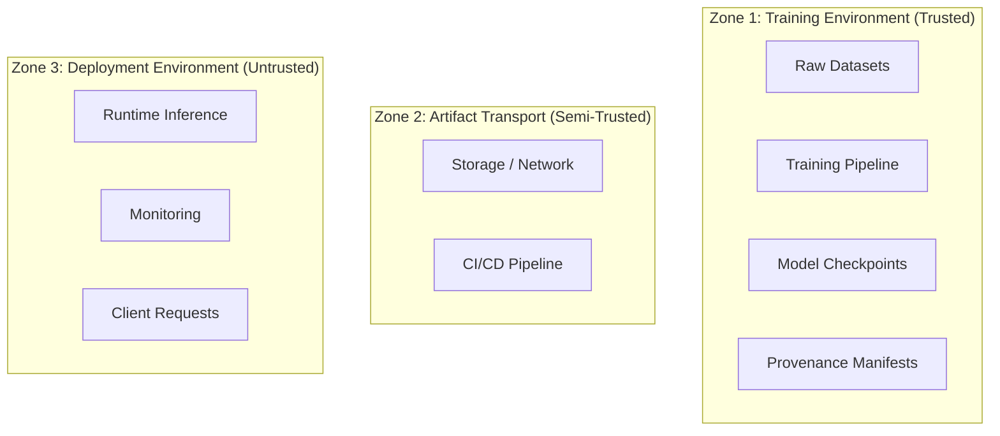

# Security Review

Last updated: 2026-06-09

## Threat Model

The HELIX-IDS system operates across three trust zones:

### Zone 1 — Training Environment

**Trust model**: Assumes the training infrastructure, datasets, and pipeline are trusted and uncompromised.

**Risks**:
- Compromised training data → poisoned model
- Malicious dependencies → backdoor in pre-processing
- Unauthorized access to checkpoints → IP theft

### Zone 2 — Artifact Transport

**Trust model**: Artifacts may pass through untrusted channels. Integrity is verifiable via manifests.

**Risks**:
- Man-in-the-middle modifying checkpoints
- Replay of old/stale checkpoints
- Sidecar/manifest tampering

### Zone 3 — Deployment Environment

**Trust model**: The deployment environment is hostile. Client input is untrusted.

**Risks**:
- Adversarial input → incorrect predictions
- Resource exhaustion → denial of service
- Model extraction through API queries

## Attack Surface

| Attack Vector | Zone | Severity | Mitigation |
|--------------|------|----------|------------|
| Dataset poisoning | 1 | **HIGH** | Learnability contract validates stats; no adversarial input validation |
| Malicious dependency (supply chain) | 1 | **HIGH** | `requirements.txt` pinned; no automated dependency verification |
| Checkpoint tampering (in transit) | 2 | **MEDIUM** | SHA-256 manifest verification detects tampering |
| Replay attack (old checkpoint) | 2 | **LOW** | Provenance chain prevents; deployment gate checks version |
| Sidecar/manifest forgery | 2 | **HIGH** | No cryptographic signing — manifests can be forged |
| Adversarial input (inference) | 3 | **MEDIUM** | `AdversarialMetrics` evaluates robustness; no real-time guard |
| Schema drift input | 3 | **MEDIUM** | Schema validation blocks; monitored |
| Model extraction (API queries) | 3 | **LOW** | No rate limiting; threshold obfuscation not implemented |
| Resource exhaustion | 3 | **MEDIUM** | No request size limits, no timeout enforcement |

## Artifact Tampering

### Detected (mitigated by manifest verification):

- Modifying a checkpoint after training ✓ (SHA-256 mismatch)
- Swapping sidecar files ✓ (embedded vs. sidecar mismatch)
- Reordering features in input ✓ (schema hash mismatch)
- Using wrong dataset with a model ✓ (dataset fingerprint mismatch)

### NOT detected (no current mitigation):

- Replacing entire artifact with a valid-looking one (no signing)
- Man-in-the-middle substituting a known-good artifact for a bad one
- Rolling back to a valid-but-outdated artifact (partial mitigation via deployment manifest)

## Supply Chain Risks

| Risk | Severity | Status |
|------|----------|--------|
| PyPI dependency compromised | **CRITICAL** | No hash-pinned requirements; no SBOM |
| Dataset source compromised | **HIGH** | No dataset source verification beyond checksums |
| Model training dependency attack | **HIGH** | `requirements.txt` has loose version pins (>=) |
| CI/CD pipeline compromise | **MEDIUM** | No CI/CD in place currently |

## Provenance Limitations

### Integrity vs. Authenticity

This distinction is fundamental:

| Property | Current | Goal |
|----------|---------|------|
| **Integrity** | ✓ Strong (SHA-256, provenance chain) | ✓ Achieved |
| **Authenticity** | ✗ Not implemented | Cryptographic signing (future) |
| **Non-repudiation** | ✗ Not implemented | Signed manifests (future) |

### What integrity guarantees:

- "This artifact has not been modified since manifest creation"
- "This artifact was trained on this specific dataset"
- "This artifact uses this specific schema"

### What integrity does NOT guarantee:

- "This artifact was created by an authorized party"
- "This artifact was created at the stated time"
- "This artifact has not been substituted with a different-but-valid artifact"

## Integrity Guarantees (Detailed)

| Component | Hash Algorithm | Where Stored | Verification |
|-----------|---------------|--------------|--------------|
| Model parameters | SHA-256 | Embedded manifest | `verify_artifact_provenance()` |
| Training config | SHA-256 | Embedded manifest | Config hash comparison |
| Dataset | SHA-256 (first 1M bytes) | Embedded manifest | Dataset fingerprint check |
| Feature schema | SHA-256 | Contract + sidecar | `assert_runtime_contract()` |
| Pipeline state | SHA-256 chain | Provenance chain | Chain verification |
| Training script | git commit hash | Manifest | Git HEAD comparison |

## Authenticity Gaps

### Gap 1: No Cryptographic Signing

Current manifests use SHA-256 hashes only — no digital signatures. Anyone with access to the artifact can modify the manifest and recompute the hash.

**Impact**: A compromised build server could substitute a trojan model with a valid-looking manifest.

**Mitigation** (procedural): Run-level access control (only trusted operators can initiate training).

### Gap 2: No Key Management

There is no public-key infrastructure to sign or verify artifacts.

**Impact**: No way to verify that an artifact came from a trusted source without side-channel verification (e.g., checking git history).

### Gap 3: No Timestamp Authority

Timestamps are local system time, not from a trusted timestamp authority.

**Impact**: An attacker can forge timestamps; temporal ordering is only as reliable as the local clock.

## Mitigations

| Mitigation | Status | Priority |
|-----------|--------|----------|
| SHA-256 integrity verification | ✓ Deployed | — |
| Provenance chain linking | ✓ Deployed | — |
| Schema contract enforcement | ✓ Deployed | — |
| Dataset fingerprinting | ✓ Deployed | — |
| Sidecar cross-referencing | ✓ Deployed | — |
| Artifact lifecycle verification | ✓ Deployed | — |
| Cryptographic signing | ✗ Not implemented | HIGH |
| SBOM generation | ✗ Not implemented | MEDIUM |
| Secure boot for deployment targets | ✗ Not implemented | MEDIUM |
| Request rate limiting | ✗ Not implemented | LOW |
| Model watermarking | ✗ Not implemented | LOW |

## Residual Risks

### CRITICAL (must address before public deployment)

1. **No dependency verification**: Pinned version ranges allow patch-level changes that could introduce vulnerabilities. Mitigation: Pin exact versions, generate SBOM, add Dependabot/Renovate.

2. **No authentication at inference endpoint**: `serve_rest.py` has no API key, JWT, or identity check. Any client that can reach the endpoint can query the model.

### HIGH (address before open-source release)

3. **No Docker image / container signing**: Environment reproducibility relies on a virtualenv, which is not fully reproducible.
4. **Training data provenance not externally auditable**: Dataset fingerprint is self-reported, not independently verified.
5. **No fuzzing or adversarial input detection at inference**: Input validation checks schema but not adversarial content.

### MEDIUM (address within 6 months)

6. **No logging of inference queries**: Cannot audit who queried what.
7. **Model extraction vulnerability**: API returns confidence scores, enabling black-box model stealing.
8. **No memory safety for C dependencies**: NumPy/PyTorch native code could contain vulnerabilities.

### LOW (ongoing)

9. **No network segmentation between deployment tiers**: Current deployment runs on a single host.
10. **No penetration testing results available**: No security audit has been performed.