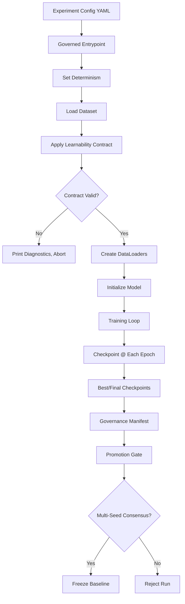
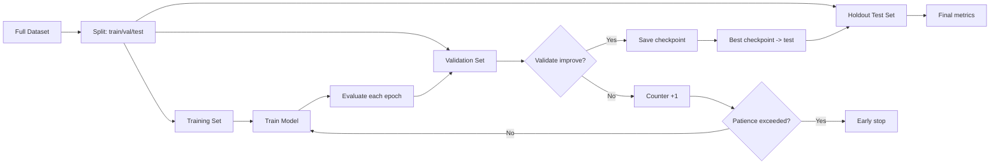

# Training Methodology

Last updated: 2026-06-09

## Training Pipeline

The HELIX-IDS training pipeline is a multi-stage process that converts processed datasets into governed model checkpoints with full provenance metadata.



## Entry Point

**Primary**: `scripts/training/train_helix_ids_full.py` (8722 lines)

Usage:
```bash
PYTHONPATH=src python scripts/training/train_helix_ids_full.py \
    --config config/experiments/smoke.yaml \
    --output /path/to/output \
    --device cuda:0 \
    --ab-baseline /path/to/baseline.pt
```

### Other training scripts:

| Script | Lines | Purpose |
|--------|-------|---------|
| `train_helix_ids_full.py` | 8722 | Primary training script (all features) |
| `train_multidataset_v2_fixed.py` | 1087 | Multi-dataset training v2 |
| `train_unsw_only_cleaned.py` | 278 | Single-dataset training (UNSW) |
| `train_unified_rebalanced.py` | 379 | Rebalanced training experiment |
| `train_edge_models.py` | 341 | Edge-device-specific model training |
| `adversarial_training_v2.py` | 261 | Adversarial robustness training |

## Hyperparameters

### Architecture

| Parameter | Default | Description |
|-----------|---------|-------------|
| `input_dim` | 41 | Canonical feature dimension |
| `hidden_dim` | 256 | Hidden layer dimension |
| `embedding_dim` | 64 | Feature embedding dimension |
| `num_family_classes` | 7 | Attack family classes |
| `num_binary_classes` | 2 | Normal vs. Attack |
| `dropout` | 0.3 | Dropout rate |
| `attention_heads` | 4 | Multi-head attention heads |
| `attention_layers` | 2 | TAM layers |

### Training

| Parameter | Default | Description |
|-----------|---------|-------------|
| `batch_size` | 256 | Training batch size |
| `eval_batch_size` | 512 | Evaluation batch size |
| `epochs` | 100 | Maximum epochs |
| `learning_rate` | 1e-3 | Initial learning rate |
| `warmup_epochs` | 10 | Linear warmup before focal loss |
| `weight_decay` | 1e-5 | L2 regularization |
| `grad_clip` | 1.0 | Gradient clipping norm |
| `label_smoothing` | 0.1 | Label smoothing epsilon |
| `focal_gamma` | 1.5 | Focal loss gamma (reduced from 2.0) |

### Class Balancing

| Parameter | Default | Description |
|-----------|---------|-------------|
| `class_balance_strategy` | `weighted_ce` | Strategy: `none`, `weighted_ce`, `sqrt_weighted_ce`, `focal` |
| `sampler_mode` | `interleaved_rr` | Sampler: `interleaved_rr`, `weighted_random` |
| `min_class4_samples` | 32 | Minimum class 4 samples per epoch |
| `class4_per_batch_min` | 1 | Minimum class 4 samples per batch |

### Loss Weights

| Parameter | Default | Description |
|-----------|---------|-------------|
| `family_margin_loss_weight` | 0.5 | Weight for margin penalty |
| `family_margin_tau` | 0.1 | Per-class margin (base) |
| `class4_logit_penalty_weight` | 0.3 | Class 4 logit dominance penalty |

### Curriculum

1. **Epochs 1-10**: Cross-entropy loss only (warmup)
2. **Epochs 11+**: Focal loss + margin penalties + class4 penalty
3. **Early stopping**: Patience=15 epochs on validation macro F1
4. **Learning rate schedule**: Cosine annealing with warm restarts

## Validation Methodology



### Split strategy:
- **Per-dataset splits** recorded in `data/splits/*.json`
- **Default**: 70% train, 15% val, 15% test (per dataset)
- **Stratified**: Preserves class distribution across splits
- **Cross-validation**: Not implemented — single holdout split

### Validation metrics (computed at each epoch):
1. Macro F1 (primary metric)
2. Per-class F1 (all 7 family classes)
3. Binary accuracy
4. Threat-weighted F1
5. Loss (all components)

## Dataset Splitting

Splits are pre-computed and stored in `data/splits/`:

```json
{
  "nsl_kdd": {"train": [0,1,2,...], "val": [1000,1001,...], "test": [2000,2001,...]},
  "unsw_nb15": {"train": [...], "val": [...], "test": [...]},
  "cicids2018": {"train": [...], "val": [...], "test": [...]}
}
```

These index files are loaded by `multi_dataset_loader.py` and used to create per-dataset splits. The combined multi-dataset training concatenates per-dataset splits.

## Seed Control

Implemented in `src/helix_ids/governance/determinism.py` (71 lines):

```python
def set_global_determinism(seed: int, deterministic_cudnn: bool = True):
    """Set deterministic behavior for reproducible training."""
    random.seed(seed)
    np.random.seed(seed)
    torch.manual_seed(seed)
    torch.cuda.manual_seed_all(seed)
    if deterministic_cudnn:
        torch.backends.cudnn.deterministic = True
        torch.backends.cudnn.benchmark = False
```

**Seed strategy**:
- Single seed per training run (configurable via `--seed` or config)
- Multi-seed consensus: 3 seeds must produce similar results for promotion
- DataLoader seeds: `seed_worker()` function called per DataLoader worker

## Checkpointing

### Checkpoint contents:

```python
checkpoint = {
    "model_state_dict": model.state_dict(),
    "optimizer_state_dict": optimizer.state_dict(),
    "epoch": current_epoch,
    "best_val_metric": best_macro_f1,
    "config": training_config,
    "run_id": run_registry_id,
    "dataset_fingerprint": learnability_contract.hash,
    "governance_manifest": {
        "schema_hash": schema_hash,
        "dataset_fingerprint": dataset_hash,
        "training_seed": seed,
        "git_commit": git_commit_hash,
        "provenance_chain": [prev_checkpoint_hash, ...],
    }
}
```

### Files written:

| File | When | Size | Retention |
|------|------|------|-----------|
| `checkpoint_epoch_{N}.pt` | Every epoch | ~4.5 MB | Deleted after run (intermediate) |
| `{variant}_{dataset}_best.pt` | New best val F1 | ~4.5 MB | Kept permanently |
| `{variant}_{dataset}_final.pt` | End of training | ~4.5 MB | Kept permanently |

### Sidecar files (with each checkpoint):
- `.artifact_manifest.json`: Provenance manifest
- `.contract.json`: Schema contract payload
- `.feature_order.json`: Canonical feature order at training time
- `.schema_hash.txt`: Schema hash at training time

## Provenance Generation

Every checkpoint is accompanied by:

1. **Embedded manifest** (within `.pt` file): SHA-256 hashes of training config, dataset, schema
2. **Sidecar files**: Human-readable provenance metadata
3. **Run registry entry**: Training run recorded in `RunRegistry` (`run_registry.py`)

Provenance is generated by `provenance.py` (813 lines):
- `build_artifact_manifest()`: Constructs the full artifact manifest
- `finalize_artifact_manifest()`: Hashes and seals the manifest
- `embed_manifest_in_onnx_metadata()`: Embeds manifest in TorchScript/ONNX metadata
- `write_contract_sidecars()`: Writes companion sidecar files

## Experiment Configs

Located in `config/experiments/`:

| File | Purpose | Key Parameters |
|------|---------|----------------|
| `smoke.yaml` | Quick validation | 5 epochs, subset of data |
| `drift_robustness.yaml` | Drift evaluation | Standard training, drift metrics |
| `edge_latency.yaml` | Edge benchmark prep | Model variants, quantization |
| `governance_ablation.yaml` | Governance feature test | All governance checks enabled |

## Exact Workflow

To reproduce training:

```bash
# 1. Activate environment
source .venv311/bin/activate

# 2. (If needed) Download and process datasets
PYTHONPATH=src python scripts/data/download_datasets.py
PYTHONPATH=src python scripts/data/process_nsl_kdd.py
PYTHONPATH=src python scripts/data/process_unsw_nb15.py
PYTHONPATH=src python scripts/data/process_cicids.py

# 3. Create canonical artifacts
PYTHONPATH=src python scripts/training/prepare_canonical_artifacts.py

# 4. Train
PYTHONPATH=src python scripts/training/train_helix_ids_full.py \
    --config config/experiments/smoke.yaml \
    --output artifacts/checkpoints/helix_full \
    --device cpu \
    --epochs 50 \
    --seed 42

# 5. Evaluate
PYTHONPATH=src python scripts/evaluation/holdout_evaluation_v2.py \
    --checkpoint artifacts/checkpoints/helix_full/helix_full_nsl_kdd_best.pt
```