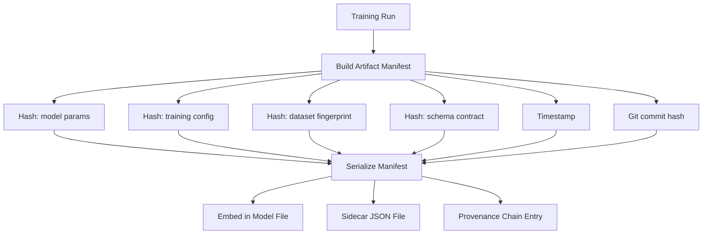
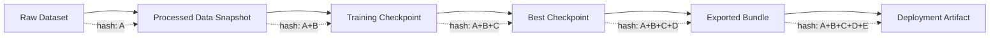
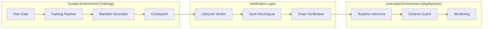

# Governance and Provenance

> How HELIX-IDS ensures artifact integrity, reproducibility, and verifiable provenance.

Last updated: 2026-06-09

## Manifest Architecture

Every artifact (checkpoint, export bundle, deployment file) carries a **manifest** — a JSON document containing cryptographic hashes of the artifact's content and its provenance chain.



### Manifest structure (`provenance.py` → `build_artifact_manifest()`):

```json
{
  "manifest_version": "1.0.0",
  "artifact_type": "checkpoint",
  "artifact_sha256": "a1b2c3...",
  "provenance_chain": [
    "previous_artifact_sha256",
    "dataset_fingerprint_sha256"
  ],
  "training_config_hash": "def456...",
  "dataset_fingerprint": "789abc...",
  "schema_hash": "fedcba...",
  "contract_version": "1.0.0",
  "exporter_version": "1.0.0",
  "created_at": "2026-06-09T12:00:00Z",
  "git_commit": "abc123def456",
  "run_id": "run_20260609_abc123"
}
```

## Provenance Chain

The provenance chain links artifacts across the pipeline:



Each artifact's manifest includes the SHA-256 of the **parent artifact**, forming a chain from raw data through to deployment. Tampering with any link breaks the chain.

### Chain implementation:

```python
# In provenance.py
manifest = build_artifact_manifest(
    artifact_path=checkpoint_path,
    parent_manifest=previous_run.manifest,   # Links to parent
    dataset_fingerprint=dataset.hash,
    schema_hash=schema.hash,
    config_hash=config.hash,
)
```

## Artifact Verification

The lifecycle verifier (`lifecycle_verifier.py`, 635 lines) checks:

1. **Content hash**: Recompute SHA-256 of artifact, compare to manifest
2. **Provenance chain**: Verify parent-artifact hash chain is intact
3. **Schema hash**: Verify embedded schema hash matches current canonical schema
4. **Dataset fingerprint**: Verify dataset hasn't changed since training
5. **Contract version**: Verify contract version is current
6. **Sidecar consistency**: Embedded manifest matches sidecar manifest
7. **Git commit**: Compare git commit to current HEAD

### Verification commands:

```python
# Programmatic
from helix_ids.governance import verify_artifact_provenance, verify_contract_integrity

verify_artifact_provenance("checkpoint.pt")
verify_contract_integrity("checkpoint.pt")

# CLI
python scripts/ci/verify_contract_sidecars.py --checkpoint checkpoint.pt
python scripts/ci/validate_schema_registry.py
```

## Deployment Manifests

When an artifact is deployed, a **deployment manifest** is created:

File: `provenance.py` → functions: `deployment_manifest_path()`, `write_deployment_manifest()`

```json
{
  "deployment_version": "1.0.0",
  "deployed_at": "2026-06-09T13:00:00Z",
  "model_artifact": {
    "path": "models/helix_full/helix_full_nsl_kdd_best.pt",
    "sha256": "a1b2c3..."
  },
  "deployment_target": "production",
  "traffic_percentage": 5,
  "promotion_gate_result": "PASS",
  "verified_by": "lifecycle_verifier",
  "contract_version": "1.0.0",
  "exporter_version": "1.0.0"
}
```

## Sidecars

Each artifact has companion sidecar files:

| File | Purpose | Contains |
|------|---------|----------|
| `.artifact_manifest.json` | Full provenance manifest | All hashes, chain, timestamps |
| `.contract.json` | Schema contract at creation | Feature order, class lists, schema hash |
| `.feature_order.json` | Canonical feature order | 41 sorted feature names |
| `.schema_hash.txt` | Schema hash | Single SHA-256 hash |

Sidecars are essential for:
- **Offline verification**: Verifier can check artifact without loading it
- **Human inspection**: JSON is readable without tooling
- **Cross-referencing**: Embedded manifest vs. sidecar consistency check

## Schema Validation

Enforced at multiple pipeline points:

| Point | Validator | Action on Failure |
|-------|-----------|-------------------|
| Data loading | `enforce_feature_order()` | SchemaDriftError — abort |
| Training start | `assert_contract()` in learnability_contract | Print diagnostics, abort |
| Evaluation | `assert_runtime_contract()` | SchemaDriftError — abort |
| Export | `verify_export_artifact()` | ExportContractError — abort |
| Inference | `runtime_contract_payload()` in inference_runtime | HTTP 400, log alert |
| Deployment | `verify_artifact_provenance()` | Deployment gate block |

## Runtime Verification

During live inference, the runtime validates:

1. **Input feature dimension**: Must be 41
2. **Feature order**: Must match canonical order
3. **No NaN/Inf**: Input validation before forward pass
4. **Schema hash against contract**: Runtime check with `runtime_contract_payload()`
5. **Model manifest match**: Loaded model's embedded manifest matches current contract

## Export Verification

The export pipeline (`utils/export.py` → `verify_export_artifact()`) verifies:

1. **Model correctness**: Pytorch vs. exported model output comparison (difference < 1e-5)
2. **Manifest integrity**: Embedded manifest hash matches artifact content
3. **Schema contract**: Export doesn't violate schema contract
4. **Version check**: Exporter version matches contract

## Trust Boundaries



## Threat Model

| Attack | Detection | Prevention |
|--------|-----------|------------|
| Artifact tampering (content changed) | SHA-256 mismatch | Manifest hash comparison |
| Training with modified data | Dataset fingerprint mismatch | Provenance chain check |
| Schema drift (reordered features) | Schema hash mismatch | Runtime validation |
| Man-in-the-middle (artifact substitution) | Chain break | Parent hash validation |
| Sidecar tampering | Sidecar ↔ embedded mismatch | Cross-referencing verification |
| Rollback attack (deploy old artifact) | Deployment manifest conflict | Version comparison in runbook |

## Integrity Guarantees

| Guarantee | Strength | Mechanism |
|-----------|----------|-----------|
| Artifact content integrity | SHA-256, collision-resistant | Embedded manifest hash |
| Dataset integrity | SHA-256 of processed data | Dataset fingerprint in manifest |
| Training config integrity | SHA-256 of config dict | Config hash in manifest |
| Pipeline reproducibility | Provenance chain | Linked parent hashes |
| Schema stability | Schema hash frozen in contract | `IMMUTABLE_SCHEMA_CONTRACT.md` |

## Authenticity Limitations

**The current governance framework does NOT provide authenticity guarantees.** Specifically:

| Gap | Impact | Mitigation |
|-----|--------|------------|
| No cryptographic signing | Anyone can create a valid manifest | Verify against a trusted manifest store |
| No key management | No identity verification | Run-level access control (external) |
| No timestamp authority | Timestamps are local | Git commit provides weak temporal anchor |
| No non-repudiation | Cannot prove who created an artifact | Logging in run registry provides audit trail |

These gaps are acknowledged in `docs/governance/ADR-001-governance-philosophy.md` (Known Limitations section) and `docs/governance/reproducibility_gap_analysis.md`.

## ADRs (Architecture Decision Records)

| ADR | Topic | Key Decision |
|-----|-------|-------------|
| ADR-001 | Governance Philosophy | Manifest-based provenance over cryptographic signing |
| ADR-002 | Schema Lifecycle | Versioned, immutable schema contracts |
| ADR-003 | Hash Authority | SHA-256 as the single hash standard |
| ADR-004 | Enforcement Pipeline | Runtime verification at every pipeline stage |

## Policy Parameters

File: `src/helix_ids/governance/parameters.py` (119 lines)

Key policies:
- `is_production_runtime()`: Enables strict enforcement in production
- `allow_legacy_artifacts()`: Controls backward compatibility
- `StageTimeouts`: Time limits for each governance stage
- `PromotionPolicy`: Multi-seed consensus configuration
- `DriftPolicy`: Drift detection thresholds